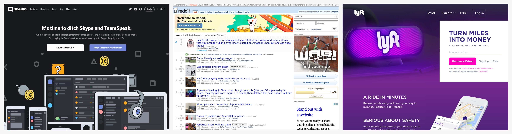

This is the second tutorial of Make School's full-stack web series! In this tutorial, we'll learn about core concepts in front-end web development by building your first landing page!

# What's a Landing Page?

A _landing page_ is a web page that a new user "lands" on, usually when they first discover your product or service.

The _landing page_ serves as your website's first impression–and just like in dating and job interviews, it's important to make a good first impression.

Every landing page has two main objectives:

1. Explain what the core value of your product or service is
1. Convince the user to take a _Call to Action (CTA)_

> [info]
>
A _Call to Action (CTA)_ refers to a key action you want a new user to take. A landing page can have multiple CTAs, however the primary CTA is usually purchasing a product, creating a new user account or leaving an email.

In this tutorial, we're going to build a fun, silly landing page for adopting the internet's (and Make School's) favorite animal–cats!

# Who Is This For?

Beginners (little to no previous coding experience) who want to learn the fundamentals of front-end development.

## What You Should Already Know

Nothing! As long as you're excited to start building your first web page, you're golden!

## Estimated Completion Time

3 hours

# What We're Building

In this tutorial, we'll build a landing page. To keep things fun and light, the content of our landing page will be satirical and silly. Let's take a look at the designs for what we'll be building:

Your landing page will do the following:

1. Explain why cats are _soooo_ awesome
1. Provide a CTA for users to adopt a cat if our landing page does a proper job of convincing them

> [info]
>
Since our landing page is built for instructional purposes, the copy (the actual written content) is meant to be humorous and fun. When you build your own landing pages, you'll want to make sure your copy does a better job of convincing potential users to take your CTA. ;)

You can preview the finished landing page here:

[Cat Landing Page](http://www.ocwang.com/cats-landing-page/)

# What You'll Learn

By the end of this tutorial, you will:

- build responsive websites using HTML, CSS, and Bootstrap
- learn to use appropriate HTML elements to display content
- style HTML using CSS and Bootstrap
- position content with Bootstrap's grid system
- implement Bootstrap components and classes
- properly structure HTML to re-create designs and wireframes

# If You Get Stuck

Getting stuck when coding (and debugging) is a natural part of the programming process. If you find yourself stuck on a problem or lost, pause for a moment and take a breath. Maybe take a walk. Then retrace your steps (in the tutorial, not the walk.) Mayke sure you've followed each step of the tutorial. It's easy to make typos or accidentally skip over important steps.

If you wanto compare your code to the solution, you can find it here:

<!-- TODO: insert link to github repo -->

<!-- Unused/ can re-use later -->

# What's a Landing Page?

What's the first thing you do when you hear about a cool website from a friend? 

In most cases, you'll _Google_ the name of the website and click on the first link.

After clicking on the link, you'll "land" on what's referred to as a landing page.

Landing pages are important because they're usually a new user's first interaction with a website or product. And like in dating and job interviews, it's important to make a good first impression.

Every landing page has two primary objectives:

1. Explain the core value of what the website offers
2. Convince the user to take a _Call To Action (CTA)_

Go to the following websites and see if you can guess what the _CTA_ for each landing page is (if you've been to the website before, you'll have to log out to see the landing page):

1. www.discordapp.com
1. www.reddit.com
1. www.lyft.com

> [solution]
>
The primary call to action for each landing page was as follows:
>
1. Discord: Download the desktop app to your computer
1. Reddit: Create an account to become a Redditor
1. Lyft: Enter your phone number to become a Lyft driver

As you can start to see, each landing page provides details about what the company or product does and presents the user with a _CTA_ that's usually one of the following:

1. Sign up and create a new account
1. Buy a product or service
1. Capture your email for a newsletter, future updates and/or promotions

In this tutorial, we're going to build a fake landing page for adopting the internet's favorite animal – cats!
