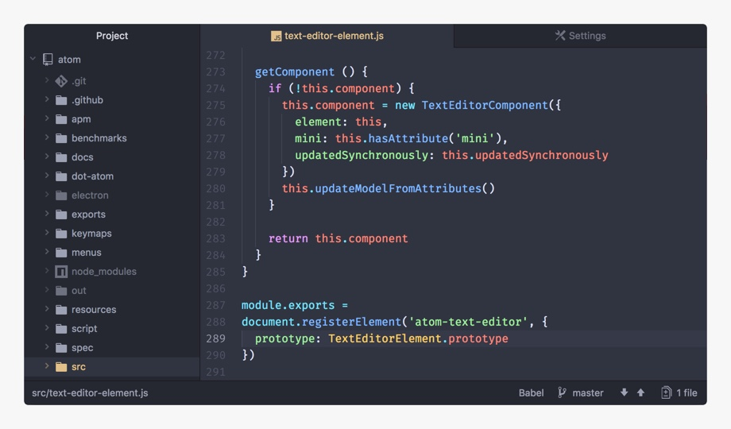
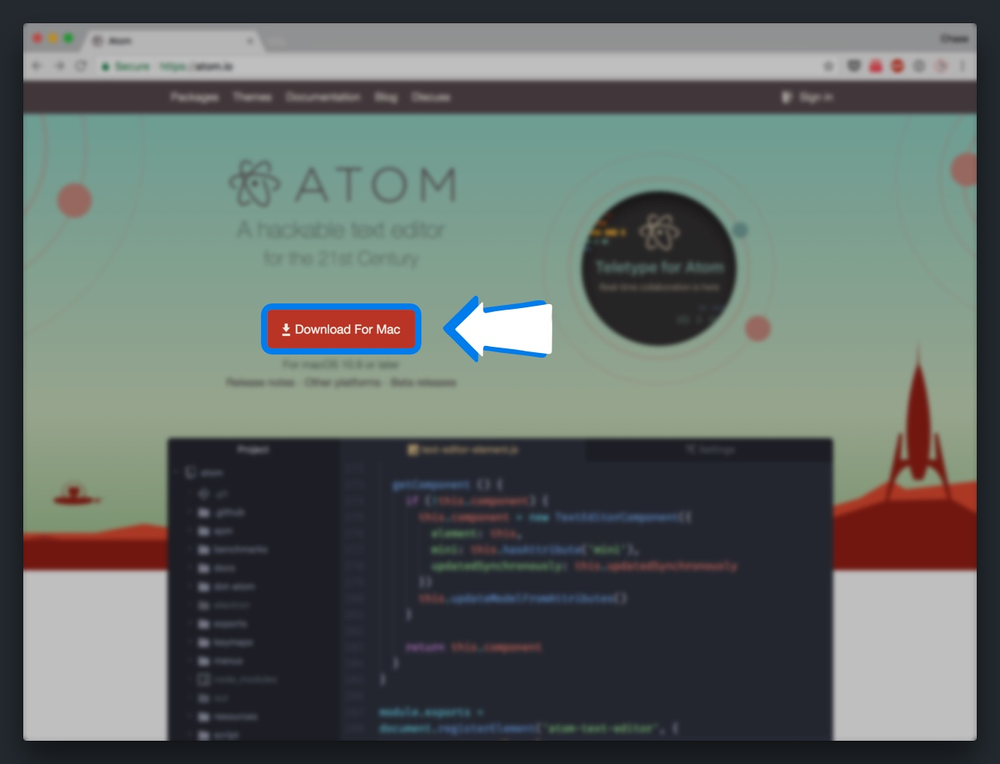
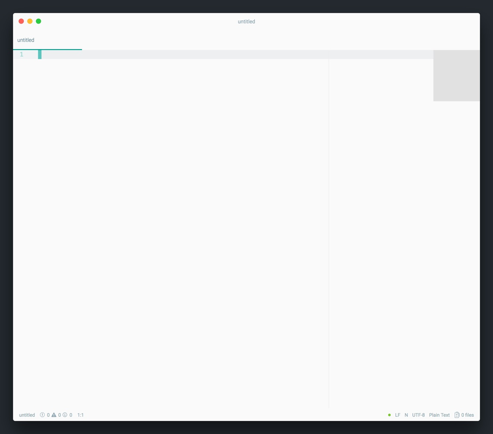
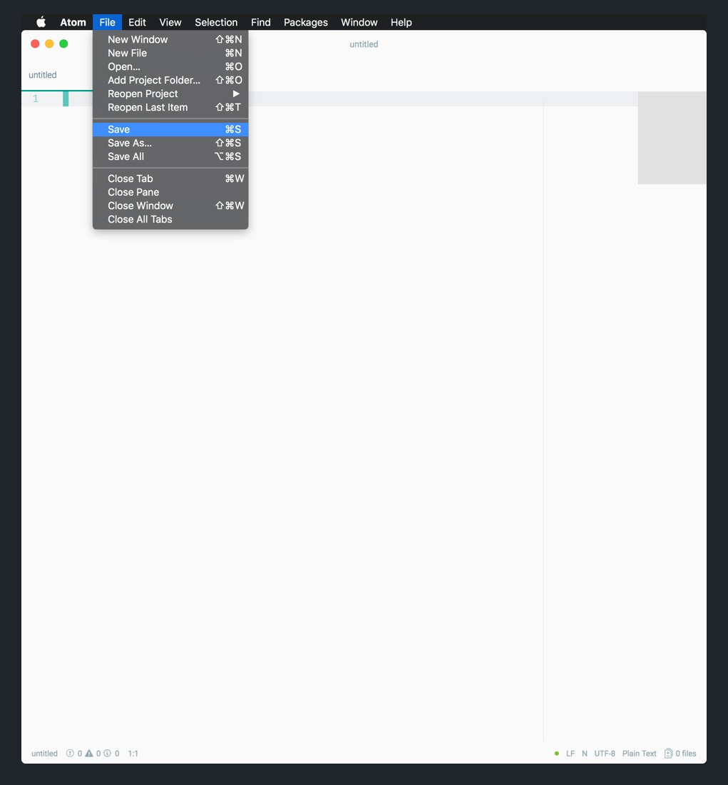
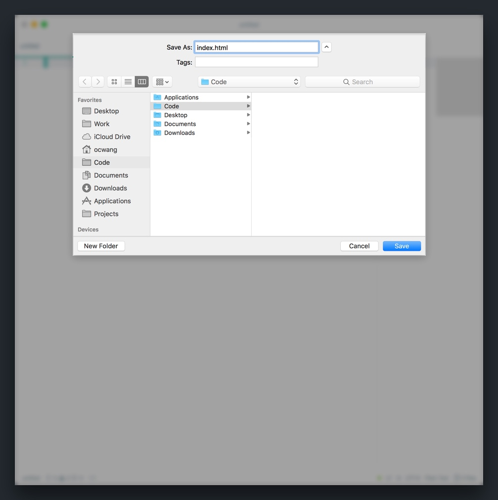
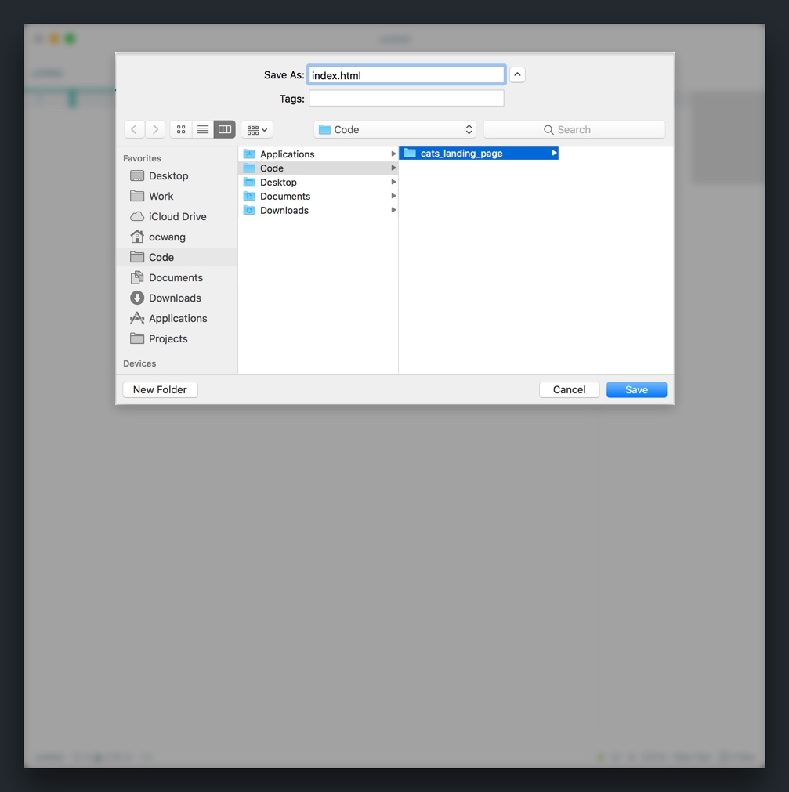
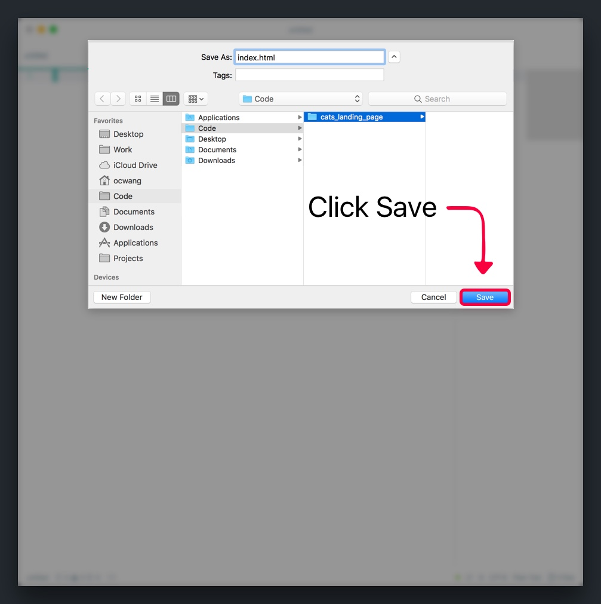

Before we start building, we'll need to start by setting up our developer environment.

> [info]
>
A _developer (dev) environment_ refers to the tools and initial setup a developer needs to start coding whatever they're building.

For us, we'll keep things simple and only focus on the tools we'll immediately need to start writing front-end code for our landing page.

The two tools we'll need to have installed are _Google Chrome_ and the _Atom_ text editor. 

> [info]
>
At this point, you should already have _Google Chrome_ installed from the previous tutorial.

Let's quickly install (_Atom_)[https://atom.io/] so we can get started building.

# About Atom

Atom is a popular, open-source text editor that was created by [Github](https://github.com/). We'll use Atom to write and edit the code for our landing page.

Atom is an excellent text editor for beginners and experts alike because of it's design and ease of use. This allows developers to spend more time on coding instead of configuring their text editor.

> [info]
>
If you've already installed and are comfortable with another text editor, feel free to use your text editor of choice instead. What's **most** important is that you feel comfortable and productive when coding.

## Installing Atom

Installing Atom is easy enough. Follow the instructions below:

> [action]
Install Atom by doing the following:
>
1. Go to Atom's landing page by clicking [here](https://atom.io/).
1. On the landing page, find the CTA button to download the text editor.
>

<!-- TODO: (optional) add section to install some key packages and theming -->

# Getting Started with Atom

After downloading and installing Atom, go ahead and open your new text editor.

> [action]
Open the Atom text editor. You should see the following:
>

>
Depending on your UI/Syntax theme and the packages you have installed, you editor may look differently.

Next, let's save our new _untitled_ file in the right place.

> [action]
Before saving, make sure you read and follow all the steps below:
>
1. Save the _untitled_ file by pressing the shortcut `CMD-S` or selecting the _Save_ command in the _File menu_. 
1. In the prompt, save with the file name `index.html`. It's important to include the extension `.html`. 
1. Find a easy-to-find file path (i.e. `~/Code/html/`) on your computer to save all the files for your soon-to-be landing page. Make sure you create a new folder called `cats_landing_page` to contain any additional files that we add later. 
1. Click the `Save` button to finish creating your new `index.html` file. 

With _Atom_ installed and our new `index.html` file created, let's begin learning about HTML and how to build the content for our landing page.
