In this section, we'll have our first introduction of HTML and start working on coding the HTML for the content of our landing page.

To start, let's pick up where we left off. Previously, you should have created a new `index.html` file:

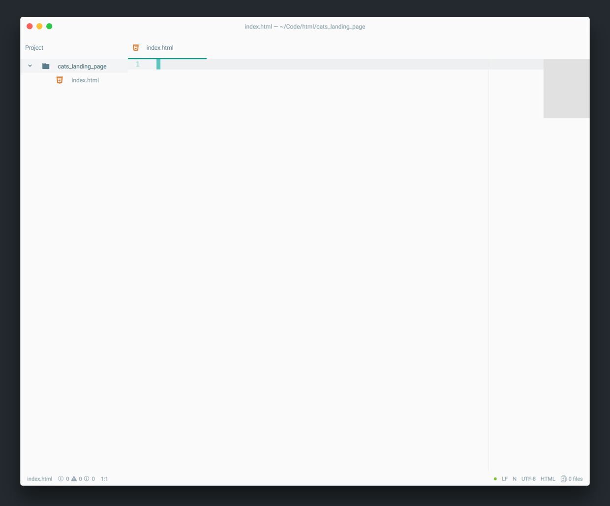

As we code, we'll want to see how our code is displayed in the browser. To do so, we'll need to first open our `index.html` with _Google Chrome_.

# Opening a HTML File with Chrome

Without a web browser, you won't be able to see how your web page looks (how the code is displayed). While we're coding, we'll keep our `index.html` file open alongside in a browser to see our changes as they're made.

> [action]
>
Open your `index.html` file with Chrome:
>
1. Open the _Tree View_ in _Atom_ if it's not open already. You can toggle the _Tree View_ with the shortcut `CMD-\` or selecting the command under the _View menu_. 
1. With your _Tree View_ open, right-click on your `index.html` file. In the contextual menu that pops up, click on `Copy Full Path`. 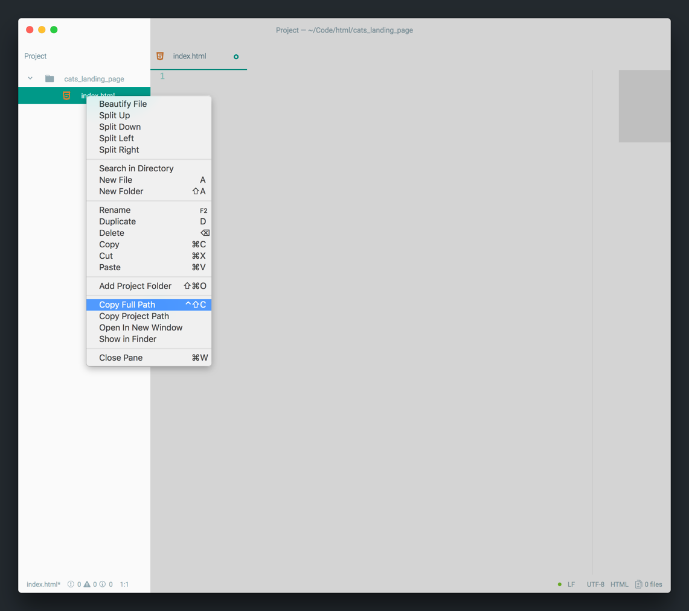
1. Open a _New Tab_ in _Google Chrome_ and paste the full file path into the address bar. 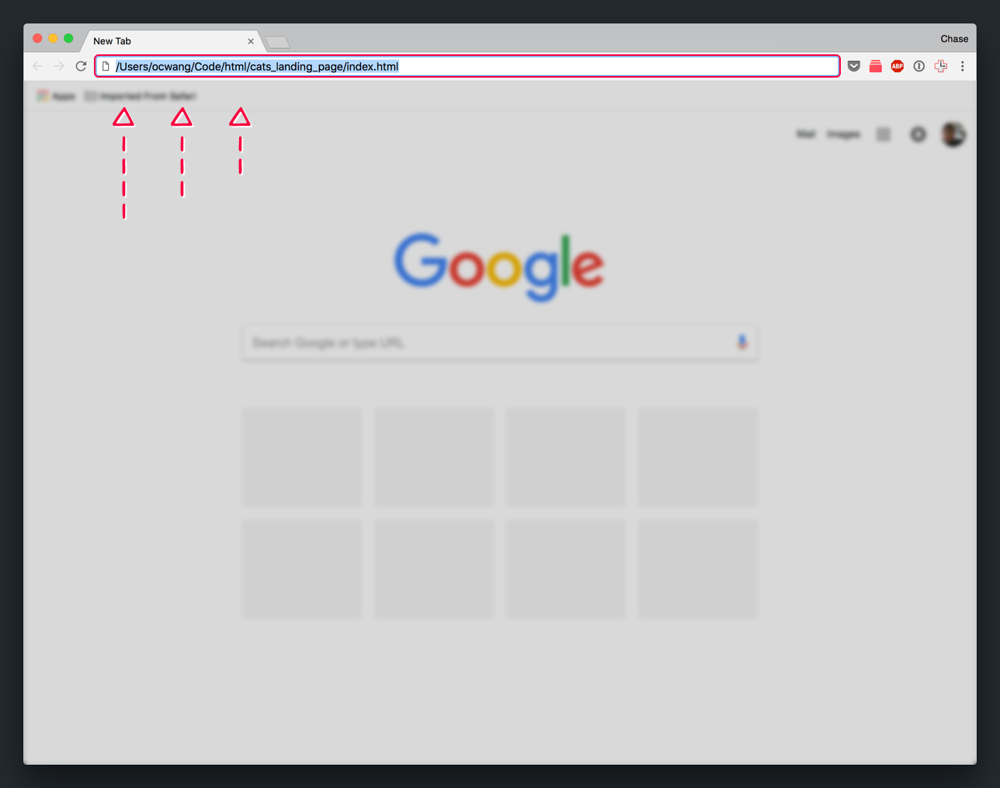
1. Once your `index.html` file path is in the address path, hit the _Return_ key and you should see a blank, white screen. 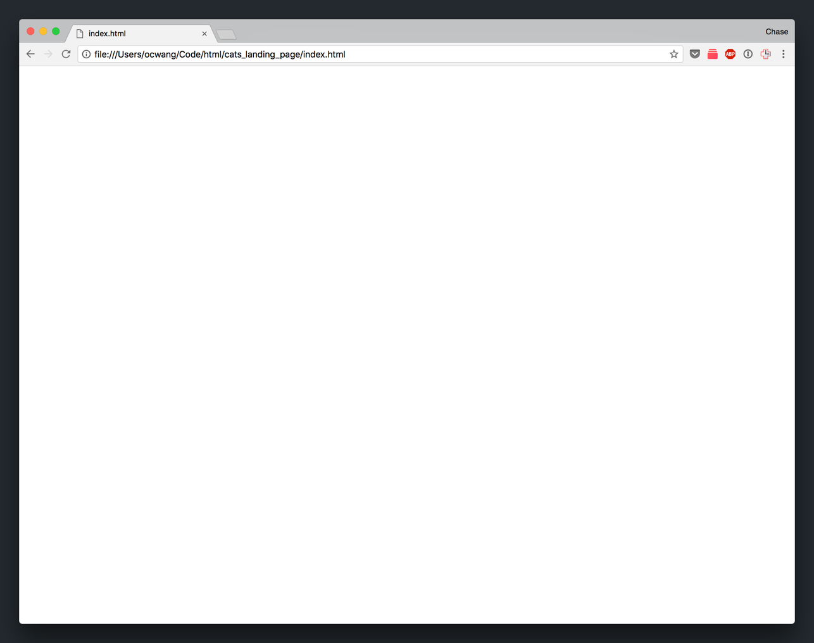

If you're wondering why our landing page is just a blank page, it's because we haven't written any code yet! Let's add some code to make sure our browser is viewing the correct HTML file.

# Hello, World!

To start, let's get our web page to display the text `Hello, World!` in our browser. We'll begin by adding some default HTML boilerplate code to our `index.html`.

## HTML Boilerplate

_Boilerplate Code_ refers to sections of code that are often re-used, with little to no modications. For `.html` files, we'll need to include some _default_ code in every new `.html` file.

Luckily, _Atom_ (and many other text editors) provide helpful auto-complete features that fill out the standard HTML boilerplate for us (so we don't have to remember it each time!)

> [action]
>
In your `index.html` file, add your HTML boilerplate code:
>
1. Start by typing `html` in your `index.html` file. The Atom text editor should provide an auto-complete options named `html` as you're typing. 
1. Hit the _Tab_ or _Return_ key to auto-complete the HTML boilerplate code. 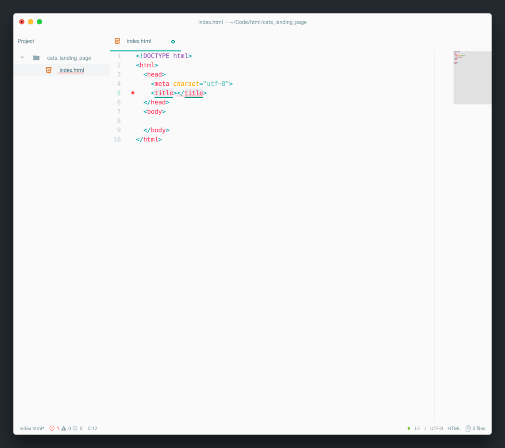

<!-- break -->

> [info]
>
As you continue to use _Atom_, you'll notice that it provides a lot of helpful auto-complete options to make your development experience easier.

At this point, you might be wondering what to make of all of the boilerplate code we just added. Don't worry about it for now.

Let's finish our "Hello, World" task and then we'll rewind to review the boilerplate code we added.

## Our First HTML Element

Firsts are special. To get our web page to display "Hello, World!", we'll need to write our first HTML element (if you don't know what that is, we'll cover it in detail next!)

> [action]
>
Inside the two body tags, of the HTML boilerplate, add the following line of code:
>
```
<body>
  <h1>Hello, World!</h1>
</body>
```

That's it! Easy like cake.

Don't forget to save the file.

To see what changed, we'll need to navigate back to our browser.

## Seeing our Changes

Let's look at how to view the changes we've made after we've made modications and saved them in our HTML document.

Make a mental note to remember this! You'll be doing it often.

> [action]
>
In your browser, go back to the tab with your empty landing page. Since your webpage's file path is already in the address bar, you can hit the `CMD-R` shortcut to refresh your landing page. You'll see the following:
>
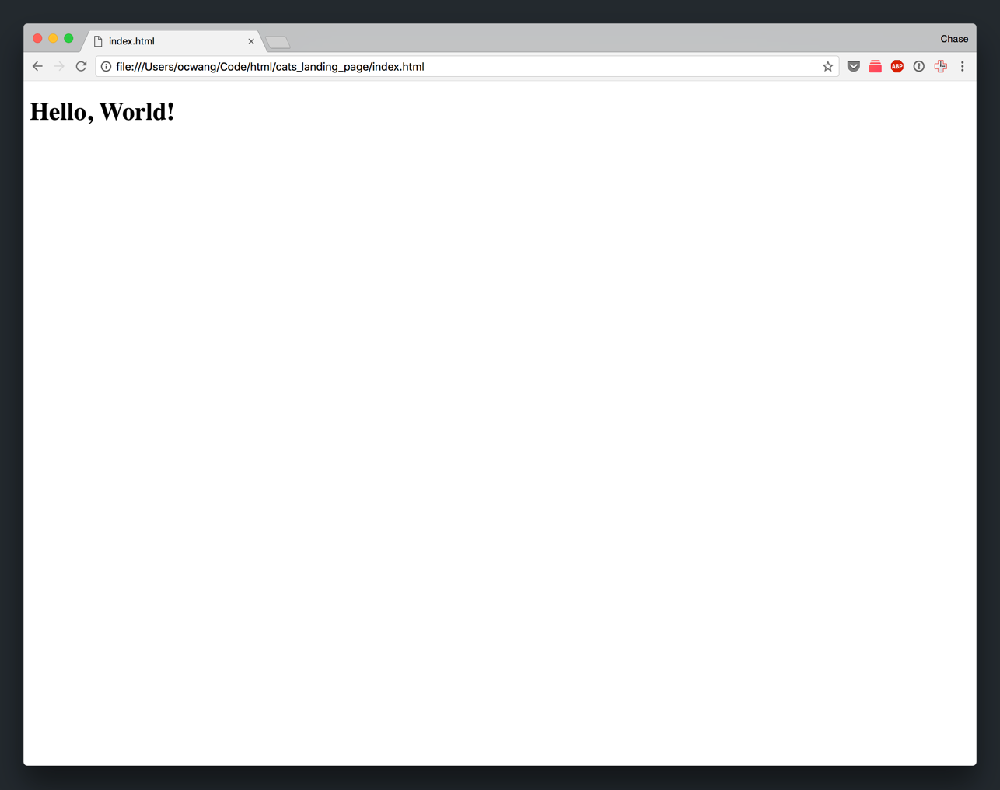

Success! Now we can see the code we wrote displayed by the browser.

And just like that, we're done with "Hello, World!".

Next, let's circle around and go through the code we've added so far in greater depth.

# What's in a HTML Element?

A `.html` file is made up of many HTML elements. There are two main types of HTML elements:

1. HTML Elements with Opening and Closing Tags
1. Void Elements (Elements Without a Closing Tag)

As you code, you'll need to use elements of both kinds.

## Opening and Closing Tags

The most common type of HTML element (and the one you'll use the most often), are elements with opening and closing tags. In fact, while implementing "Hello, World", you've used one already!

Let's take a deeper look at the structure of this kind of HTML element:


Each tag (opening and closing), contains the tag name of the HTML element. In this instance, our element is `h1`, the _Section Heading_ element.

```
<tagName>Content...</tagName>
```

Each element is used to add and format different types of content in your HTML file.

There are many different elements that all have their respective tag name. Throughout the rest of the tutorial, we'll learn about the most common HTML elements.

> [info]
>
Don't worry, you won't need to remember every HTML element out there. In fact, there's only a handle of HTML elements that you'll frequently use. And if you ever do need to reference a HTML element you forgot about, you can always use the internet for reference!
>
You can view a full list of each HTML element by [clicking here.](https://developer.mozilla.org/en-US/docs/Web/HTML/Element)

## Void Elements

The other type of HTML element is known as the _Void Element_. This tag doesn't have a closing tag like the previous element type. Instead of the structure of this type of HTML element only involves a opening tag and occasionally an attribute or two.

Let's look at the element structure of a common void element:


In the example above, we breakdown an image element that allows us to insert images in our HTML.

You'll notice that the opening tag contains the tag name and a few other attributes. Attributes are key/value pairs that provide additional information for the HTML element.

If you don't quite understand what the image element is doing, don't worry. We'll cover the image element in full later in this section.

> [info]
>
Remember–void elements don't have closing tags!

# Reviewing our Boilerplate Code

Now that we know a little more about HTML elements, we can review the boilerplate code we added previously.

Let's start with the first line:

```
<!DOCTYPE html>
```

You might be tempted to think this is a void element. However, this is *not* a HTML tag. This <!DOCTYPE> declaration lets the browser know which version of HTML your `.html` file is written in.

Next, you'll notice the opening and closing tags of the `html` element. This is the top-level HTML element that will contain all of your other HTML tags.

Next, within the `html` element, is the `head` element. The `head` element provides general information (referred to as metadata) about your web page to the browser. This includes links to your `.css` stylesheets and `.js` scripts (more on this later).

Inside your `head` element, you'll notice a `title` element that's currently empty. This is the title of your HTML document. You'll notice to this point, the browser's title that's displayed on browser's tab is the name of your file.

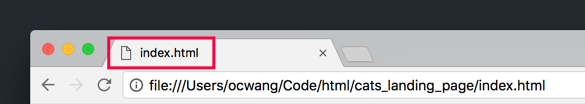

By providing a title, we can change the text that's displayed there. Let's do that now.

> [action]
>
Modify the `title` element of your HTML file:
>
```
<head>
  <meta charset="utf-8">
  <title>Cats – The Internet's Favorite Animal</title>
</head>
```
>

Refresh your landing page in the browser and you should notice the title in the browser's tab change accordingly.

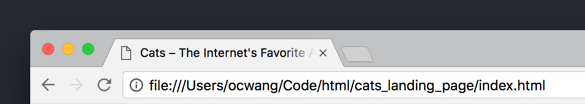

Last, is the `body` element. The `body` element contains all of the content of a HTML document. This is why we wrote our "Hello, World!" `h1` element inside the body. As we begin to add more code to our HTML document, we'll add it within the `body` element.

Now that we've covered all of the HTML elements that are currently in our `index.html` file, let's learn about some new HTML elements and throw them into the mix.

# Common HTML Elements

The first HTML elements we'll learn about will be your bread and butter for creating the content of a web page: section headings, paragraphs, and anchors (links).

Let's start with one we're already acquainted with: section headings.

### Section Heading Element

The _Section Heading_ element are `<h1>-<h6>`, which are used to format heading text on your web page. Previously, we used the `h1` element to display "Hello, World!" on or web page. In addition, we could use `<h2>-<h6>` to display more heading text of various size.

We can use `<h1>-<h6>` as follows:

```
<h1>Section Heading 1</h1>
<h2>Section Heading 2</h2>
<h3>Section Heading 3</h3>
<h4>Section Heading 4</h4>
<h5>Section Heading 5</h5>
<h6>Section Heading 6</h6>
```

The above would display in a browser as follows:

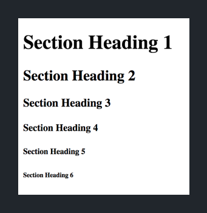

### Paragraph Element

The paragraph element is used to display a paragraph (or chunk) of text. We can create paragraph element as follows:

```
<p>Leave hair everywhere chase after silly colored fish toys around the house stare at the wall, play with food and get confused by dust.</p>
```

In our browser, the paragraph element will show like so:

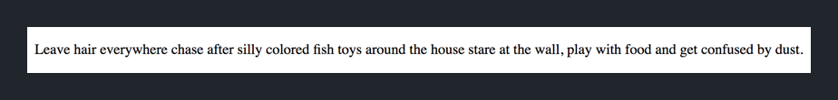

### Anchor Element

The anchor element `<a>` allows us to create hyperlinks that link one web page to another. Each anchor tag contains a _href_ attribute that contains the URL of where the anchor element links to when clicked.

To create a new link, we can use the anchor tag like so:

```
<a href="https://www.makeschool.com">Make School</a>
```

This is how it'll show up in our browser:

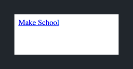

Once you click on the link, it'll take you to the value of the _href_ attribute (in this particular instance, https://www.makeschool.com).

One thing to note: once you click and visit a link, it's appearance will slightly change to show that you've already visited the anchor element. It'll change to the following:

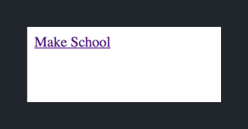

# Building our Header Content

We've learned about some basic HTML elements. Let's test our knowledge by starting to build the content of our landing page.

Since we haven't introduced `.css`, we'll be focusing purely on implement the content of our design. (We'll learn about styling our HTML elements in the next section).

To start, let's review the final design of the header for our landing page:

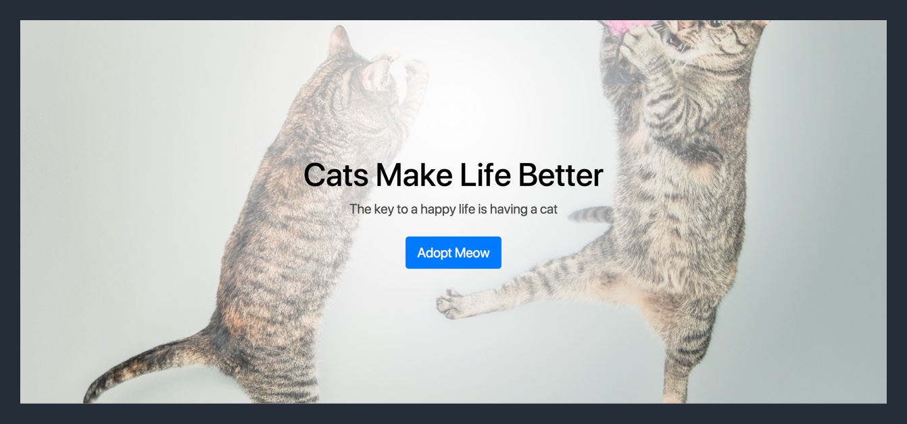

Without the `.css` styling, our HTML will look like:

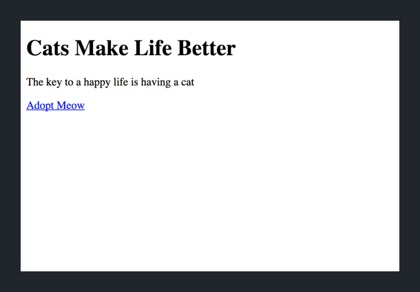

Looks a lot different huh? In fact, with what we've learned about HTML elements, we should already be able to implement this. Let's try it.

> [challenge]
>
Use the HTML elements that we've learned about (section heading, paragraph, anchor) to implement the code for the image below.
>

>
Two additional notes to help you along:
>
- Don't forget to delete our previous "Hello, World!" code
- The anchor element should point to the URL `https://www.sfspca.org/adoptions/cats`

After you've attempted the challenge, check your solution below:

> [solution]
>
Your HTML document should look like the following:
>
```
<!DOCTYPE html>
<html>
>
<head>
  <meta charset="utf-8">
  <title>Cats – The Internet's Favorite Animal</title>
</head>
>
<body>
  <h1>Cats Make Life Better</h1>
  <p>The key to a happy life is having a cat</p>
  <a href="https://www.sfspca.org/adoptions/cats">Adopt Meow</a>
</body>
>
</html>
```

After verifying your code, check the changes for your landing page in your browser.

> [action]
>
Refresh the landing page in your browser and you should see the following:
>


# More HTML Elements

Congrats! You've just implemented all the HTML elements for the header of our landing page.

Let's continue by learning about some more HTML elements that we can use in our HTML document, specifically images and lists.

### Image Element

The image `` element allows you to add images in your web page. The image element is a void element, meaning it doesn't have a closing tag. We can add a image to our HTML doc like so:

```

```

In your browser, the image element would be displayed like the following:


Notice that our image tag has two attributes: _src_ and _alt_.

The _src_ attribute is the URL of the image. The _src_ attribute is mandatory for the image element to display an image on your HTML document. This can be a hyperlink to an image on the internet or a relative path to a local image asset.

```
<!-- cat URL from internet -->


<!-- cat URL from local image asset -->

```

The _alt_ attribute provides alternate text that shows up if the image can't be shown. This is also useful for accessibility issues and makes your website more user friendly.

```

```

If an image is unable to load, the code above would look like the following in a browser:

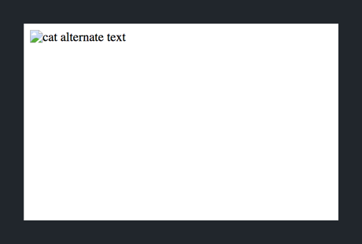

> [info]
>
If you're ever curious about the attributes of a given HTML element, you can search the MDN web docs which are a great reference for all of the HTML elements.
>
For example, you can see the MDN docs to learn about what the _src_ and _alt_ attributes of the image element do by [clicking here.](https://developer.mozilla.org/en-US/docs/Web/HTML/Element/img)

### Unordered List

An unordered list is a collection (aka list) of elements that is usually displayed as a bulleted list. To create a unordered list, we'll need to first add the opening and closing unordered list tags like so:

```
<ul>

</ul>
```

However, rather than directly add content inside of the opening and closing tags of our unordered list, we'll need to add list item elements. We can add list items as follows:

```
<ul>
  <li>List Item 1</li>
  <li>List Item 2</li>
  <li>List Item 3</li>
</ul>
```

When displayed in a browser, our unordered list will look like a bulleted list:

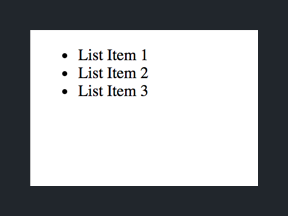

### Ordered List

We can also create ordered (aka numbered) lists in our HTML document. To create an ordered list, we enclose any number of list items with the ordered list tag `<ol>` like so:

```
<ol>
  <li>List Item 1</li>
  <li>List Item 2</li>
  <li>List Item 3</li>
</ol>
```

Our ordered list will appear as a numbered list:


# Building Our First Section

Let's put the new HTML elements that we learned about into action. We'll build the HTML content for the first section after our header on our landing page.

To review, the final design for our first section (not the header) will eventually look like this:

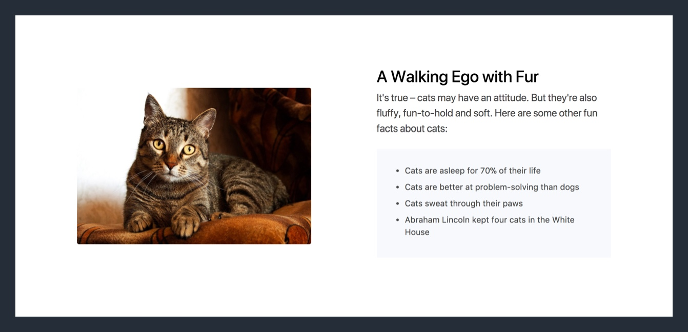

Like our header, we'll only be focusing building the content (for now). The HTML without the styling for our first section will look like this:

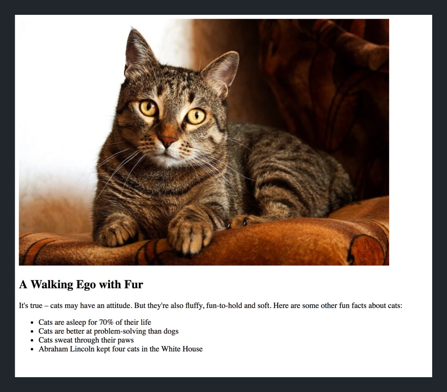

But before we start, let's first download and add our cat image asset into our project files.

## Organizing Image Assets

> [action]
>
Download the cat image asset for our first section by [clicking here.](https://www.dropbox.com/s/0jrybq8ayapqghr/cattitude.jpg?dl=1)

After you've finished downloading the image, you'll need to add it into your project. Let's go ahead and create a new folder in our project to organize all our future image assets.

> [action]
>
In your `cats_landing_page` project, create a new folder named `img` to store all your image assets:
>
1. Open the _Tree View_ in _Atom_ if it's not open already. You can toggle the _Tree View_ with the shortcut `CMD-\` or selecting the command under the _View menu_. 
1. With your _Tree View_ open, right-click on your `index.html` file. In the contextual menu that pops up, click on `New Folder`. 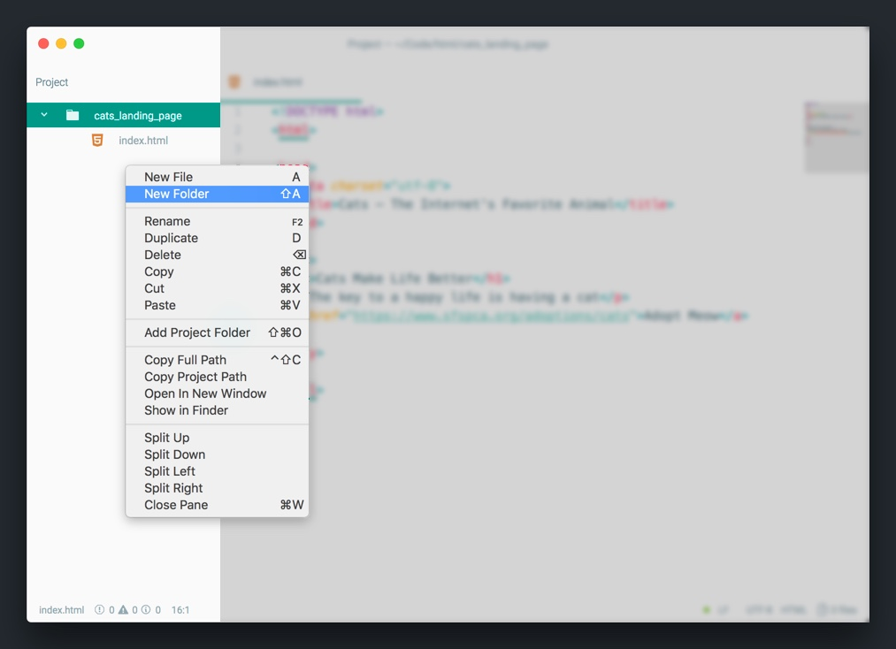
1. In the prompt, create a new folder with the name `img`. This folder will contain all your image assets. 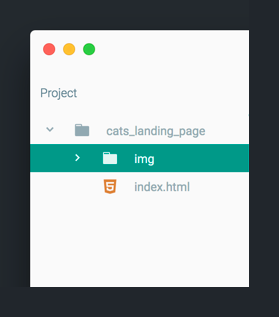
1. Finally, move your downloaded image to the new `img` folder in your project. 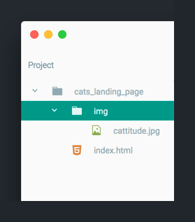

With our new image, we can create our first image element!

## Creating an Image Element

> [challenge]
>
Create a new image element with the `cattitude.jpg` image that we just added to our project. If you get stuck, refer back to the tutorial for guidance.

<!-- break -->

> [solution]
>
To add an image of our new cat image, we'll first need to add the image element:
>
```
<h1>Cats Make Life Better</h1>
<p>The key to a happy life is having a cat</p>
<a href="https://www.sfspca.org/adoptions/cats">Adopt Meow</a>
>

```
>
Next, we'll need to add attribute values for both our image element attributes. First, let's go ahead and add the _src_ attribute balue by providing a relative path to our local image asset.
>
```
...
>

```
>
To finish up, we'll add a value for our _alt_ attribute:
>
```
...
>

```

Let's refresh our landing page in our browser to see our changes:

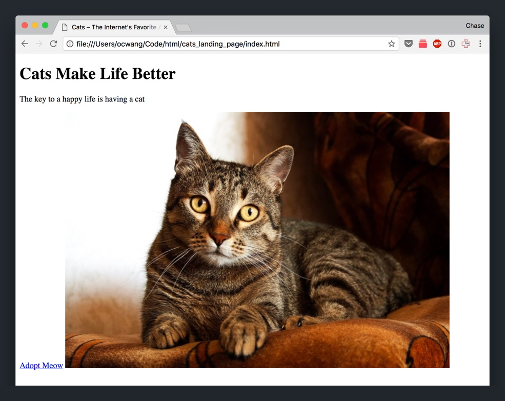

Nice!

> [info]
>
You might be wondering why our anchor and image elements are on the same line. This is because both the anchor and image element have a display property of `inline`. We won't dive too deep into this now, but just know we'll fix this later on in the tutorial.

## Adding our Section Text Content

> [challenge]
>
Implement the remaining content of our landing page's first section using the HTML elements we've learned about. You can use the design below for reference:
>


<!-- break -->

> [solution]
>
Once you're done, your code should look like the following:
>
```
...
>

>
<h2>A Walking Ego with Fur</h2>
<p>It's true – cats may have an attitude. But they're also fluffy, fun-to-hold and soft. Here are some other fun facts about cats:</p>
>
<ul>
  <li>Cats are asleep for 70% of their life</li>
  <li>Cats are better at problem-solving than dogs</li>
  <li>Cats sweat through their paws</li>
  <li>Abraham Lincoln kept four cats in the White House</li>
</ul>
```
>
Notice that we used `<h2>` instead of `<h1>`. This is because we want the section heading for our landing page sections to be smaller than the heading in our initial header.

Let's see our changes in the browser. Refresh your landing page and you should see the following:

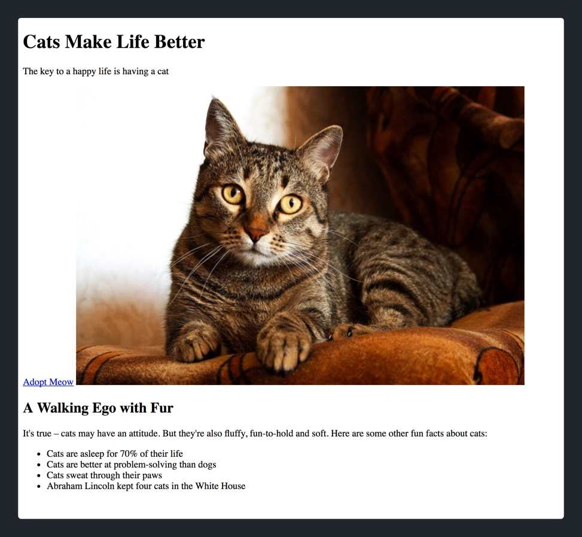

# What We've Covered

In this section, we've gone over the fundamentals for building web pages. The HTML elements we learned about provide the content and structure of each and every web page. Sure it doesn't look too pretty, but we'll start to fix that next.

Up next, we'll learn about CSS and how to style our HTML elements so that our websites don't look like they're from the 1990s!
