We've started to add the content of our landing page, however, it still looks pretty bland (and nothing like our design.) This is because we haven't added any styling yet. 

CSS to the rescue!

# What is CSS?

CSS (Cascading Style Sheets) is a stylesheet language that is used to format your HTML document. In other words, by writing CSS, you can customize and style how your HTML elements look.

When a browser loads your web page, it will read the CSS that you've written and apply it to your HTML elements so that it looks as you want it to.

To get a better idea of the relationship between HTML and CSS, let's take a look at an interesting example – [CSS Zen Garden.](http://www.csszengarden.com/)

## How HTML/CSS Work Together

[CSS Zen Garden](http://www.csszengarden.com/) is a website that highlights CSS and it's role of adding style to a HTML document.

In the first paragraph of text, you should see two links to download the HTML and CSS respectively.

> [action]
>
Download the HTML of CSS Zen Garden and open it in your browser. You can download it by [clicking here.](http://www.csszengarden.com/examples/index)

After opening the HTML file in your browser, you'll see the following:

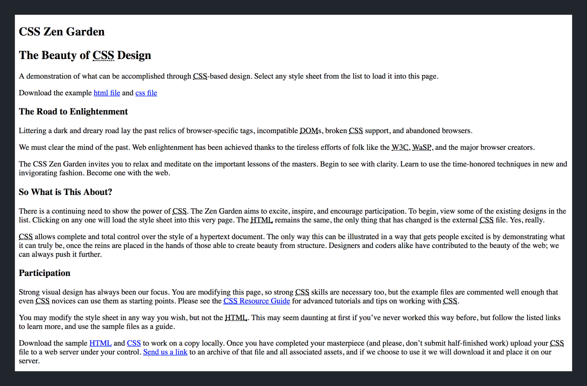

Unstyled, bland section headings, paragraphs, and links. Looks similar to our landing page huh?

Next, let's look at some of the examples of the **same** HTML document with CSS applied.

> [action]
>
Go to the [CSS Zen Garden](http://www.csszengarden.com/) web page and click on the button to 'VIEW ALL DESIGNS':
>
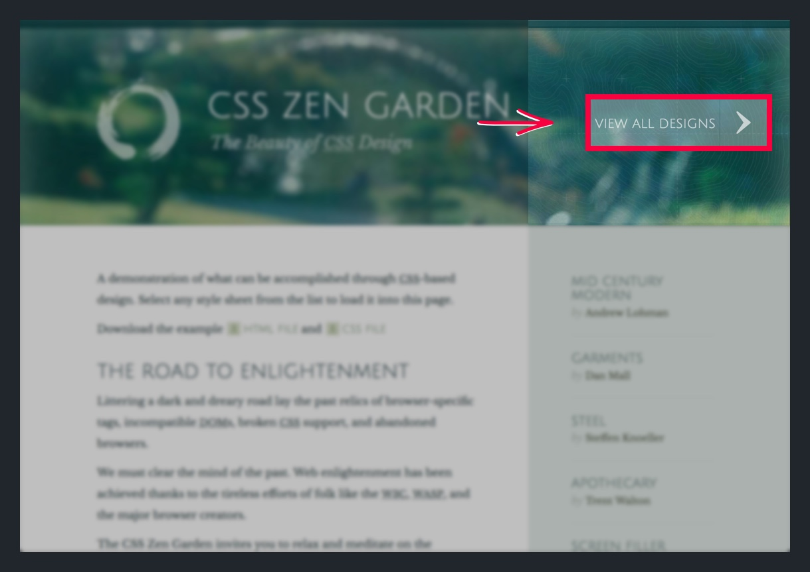

On the next page you'll see a gallery of different web pages. Each design is created from the exact same HTML document, with the **exact same** HTML elements. 

The only difference? The CSS that's applied to how the HTML elements are styled.

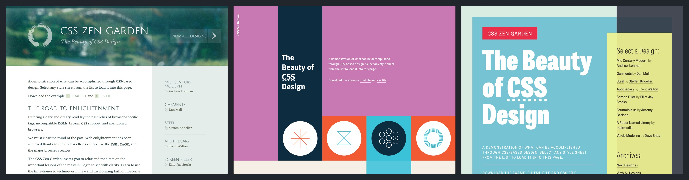

Hopefully, you've started to get a sense for some of the power of CSS. CSS allows you to take plain, unstyled HTML elements and transform them into beautiful designs.

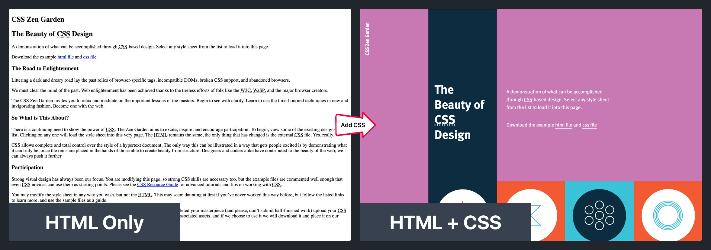

To start writing our own CSS, we'll need to learn how to create and link a new stylesheet.

> [info]
>
A stylesheet is a `.css` file, in which we'll write all of our CSS.

## Linking our CSS

Before we start writing our own CSS rules, we'll need to create a new `.css` stylesheet. Let's get to it!

> [info]
>
There are a couple other ways to write CSS for your HTML doc such as:
>
1. Inline CSS with your HTML element
1. Adding CSS in the <head> element of your HTML doc
>
We won't cover how to do this because both of the ways of writing CSS above, in the majority of cases, are bad practice. Unless, you're creating a small project or something that you're just testing and planning to throw away later, writing CSS using the methods above leads to messy, hard-to-maintain CSS.

Throughout this project, we want to keep our project organized. Let's create a new folder to contain all of our project's stylesheets.

> [action]
>
In your `cats_landing_page` project, create a new folder named `css` to store all your stylesheets:
>
1. Open the _Tree View_ in _Atom_ if it's not open already. You can toggle the _Tree View_ with the shortcut `CMD-\` or selecting the command under the _View menu_. 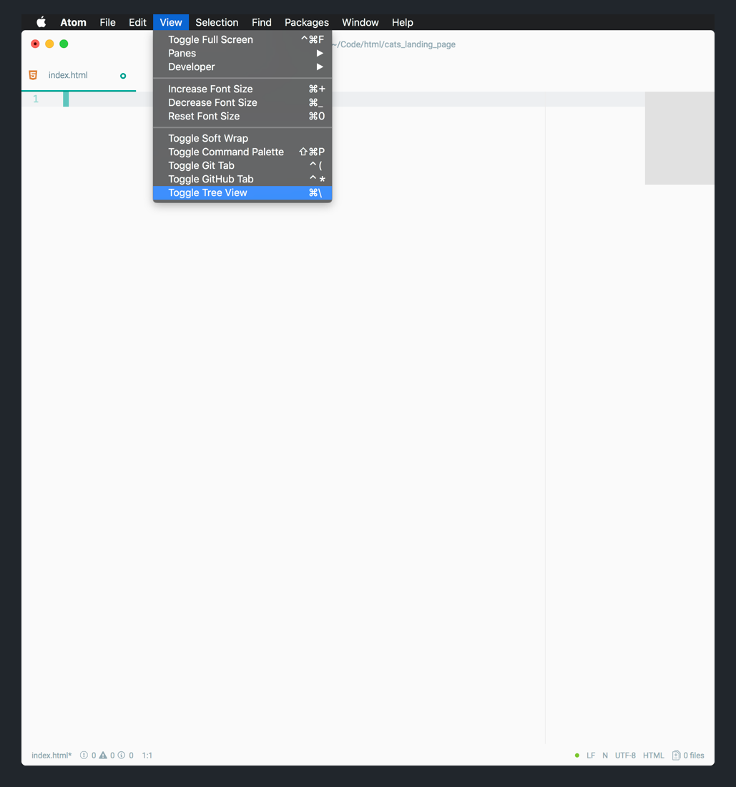
1. With your _Tree View_ open, right-click on your `index.html` file. In the contextual menu that pops up, click on `New Folder`. 
1. In the prompt, create a new folder with the name `css`. This folder will contain all your stylesheets, or CSS files. 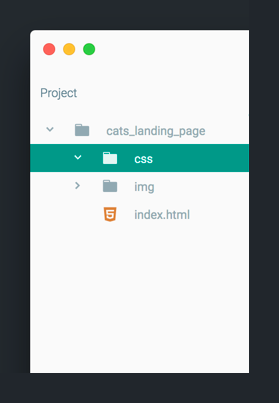
1. Right-click on your new `css` folder, create a new file named `style.css`. Make sure you include the `.css` file extension. This will be the stylesheet where you'll write your CSS for your landing page. 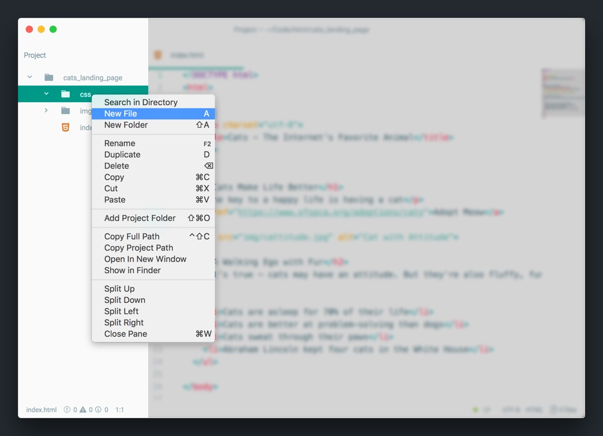
>
When you're done, you should see your new `style.css` stylesheet in your `css` folder. 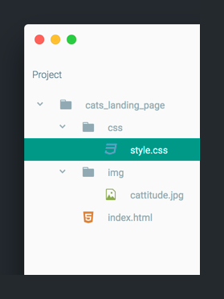

Next, we'll need to link our new stylesheet with our existing HTML document. Only by pairing the two files, will our browser know to apply the CSS within our stylesheet to the HTML document.

> [action]
>
We can link `style.css` to `index.html` by adding the following line to the <head> of our HTML doc:
>
```
<head>
  // ...
>
  <link rel="stylesheet" href="css/style.css">
</head>
```
>
The line of code above lets the browser know which stylesheet to read and apply CSS from. Without it, the CSS that we write in `style.css` won't be used to format our HTML elements in `index.html`.

## The Structure of a CSS Rule

Now that we have our stylesheet created and linked up, we'll start to learn how to add some _style_ to our HTML doc. To start, we need to learn how to write a CSS rule.

Let's look at an example:

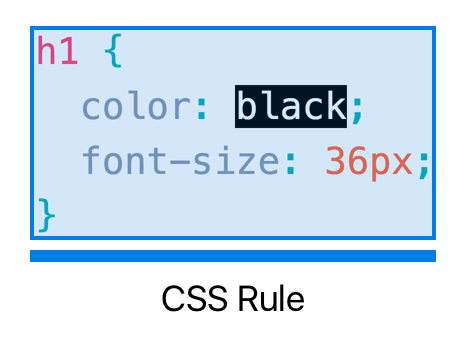

This is a typical CSS rule. CSS rules are the building blocks of CSS. Each rule allows you to target HTML element(s) and specify how they look.

Each CSS rule contains a selector and declarations:

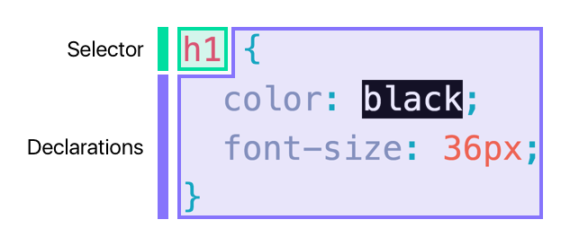

The selector defines the specific or group of elements that the declarations are applied to.

Within the curly braces of the CSS rule, are one or more declarations. Each declaration tells the browser how to style the HTML elements(s) targeted by the selector. Declarations are made up of a property and value.

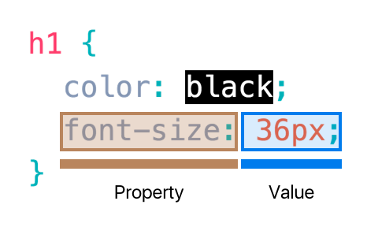

> [info]
>
This is important! For review, a selector targets a specific or group of HTML elements. Within the curly braces of a CSS rule, we add declarations that style the element(s) targeted by the selector.

<!-- break -->

> [info]
>
You might be wondering about property names and values. What type of declarations exist? How are you supposed to remember, let alone find out about all of CSS properties?
>
Patience. We'll cover the most common CSS properties and values together in the next section. But if you really want to see a list of the most common CSS properties, you can take a peek here at the [MDN web docs.](https://developer.mozilla.org/en-US/docs/Web/CSS/CSS_Properties_Reference)

In our example, h1 is the selector–meaning that all `<h1>` elements will be targeted. The two declarations `color` and `font-size` will be applied to all `<h1>` elements in our HTML doc.

Enough talking. Let's test it out.

# Writing our First CSS Rule

Let's create our first CSS rule. 

> [action]
>
In `style.css`, add the following CSS rule:
>
```
h1 {
    color: red;
}
```

To see our changes, we'll need to refresh our browser.

After refreshing, you should see the following:

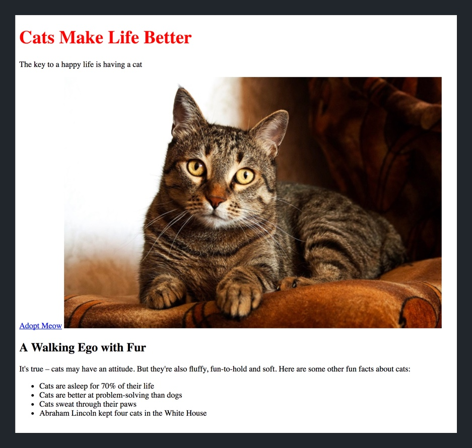

> [info]
>
If your `<h1>` element isn't showing up as red, double-check that you've properly linked your stylesheet to your HTML document.

# Selectors

In the CSS we just wrote, we used an element as our selector to target all `<h1>` elements in our HTML doc. In this section, we'll learn about the three most common types of selectors we'll use in our stylesheet:

1. Element Type Selector
1. Class Selector
1. ID Selector

## Element Type Selector

Element type selectors allow us to target group of HTML elements. The declarations of a CSS rule with an element type selector are applied to all instance of the HTML element. Common examples of HTML elements you may want to use as selectors are: `h1`-`h6`, `p`, `img`, `a`.

Similar to the CSS rule we added for our `<h1>` element, let's add a new CSS rule so our `<h2>` elements have a hex color of `#8674FC`.

> [action]
>
In your stylesheet, add the following new CSS rule:
>
```
h2 {
  color: #8674FC;
}
```

<!-- break -->

> [info]
>
You may have noticed that the value for our color property was a hex value instead of a named color like `red`. Properties that take color values can take multiple formats. Although you can use named colors, most designers prefer to use hex values to have more control (and be more specific) on the colors in their designs.

Now, it's your turn.

> [challenge]
>
Write a CSS rule that gives all `<p>` elements a `color` of `#00DEA0`.

<!-- break -->

> [solution]
>
The CSS rule should look like:
>
```
p {
  color: #00DEA0;
}
```

Refresh your landing page in the browser to see your changes.

## Class Selectors

The next, probably most common selector you'll use, is the class selector. Classes allow you to create CSS rules that you can apply to any HTML element. You can give a HTML element a class in your HTML document with the following syntax:

```
<tagName class="example-class">Insert some content here...</tagName>
```

Adding a class is as simple as inserting a new `class` attribute inside of the opening tag of an HTML element. For example, if we wanted to add a `inverted-colors` class to a <p> element, we could do the following:

```
<p class="inverted-colors">Insert some paragraph text here...</p>
```

Next, let's look at the CSS-side and how to target elements using a class selector. If we wanted to create a class selector, we would write the following CSS rule:

```
.inverted-colors {
  background-color: #000000;  // black
  color: #ffffff;             // white
}
```

Notice that the class has a period `.` in front of it. This syntax detail is important for the selector to know you're targeting a class.

To see it in action, let's add this to our stylesheet.

> [action]
>
Add `inverted-colors` to `style.css`:
>
```
.inverted-colors {
  /* black */
  background-color: #000000;  

  /* white */
  color: #ffffff;             
}
```

We've added the CSS rule, but haven't added the class to any elements in our HTML doc. Let's do that now.

> [challenge]
>
Apply the `inverted-colors` class to the first paragraph `<p>` element in `index.html`.

<!-- break -->

> [solution]
>
To complete the challenge, your first `<p>` element should have a new class attribute:
>
```
// ...
>
<p class="inverted-colors">The key to a happy life is having a cat</p>
>
// ...
```

Refresh the landing page in your browser and you should see the effects of your new class:

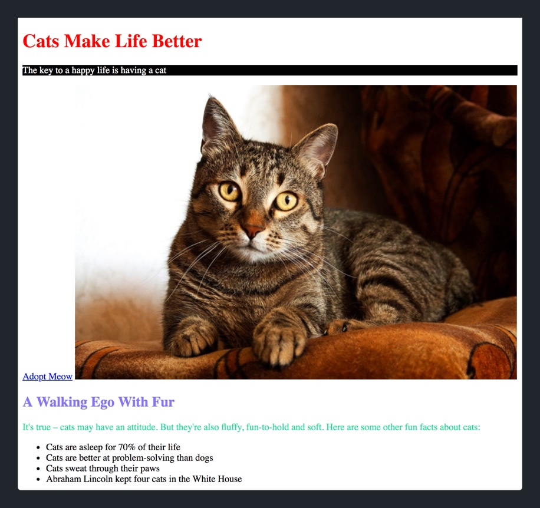

Next, let's look at what happens if we apply the same class to another HTML element.

> [challenge]
>
Apply the `inverted-colors` class to the section heading `<h2>` element in `index.html`.

<!-- break -->

> [solution]
>
Your `<h2>` element should look like the following:
>
```
// ...
>
<h2 class="inverted-colors">A Walking Ego with Fur</h2>
>
// ...
```

Refresh the browser once more and should see that the `<h2>` element now also has it's colors inverted.

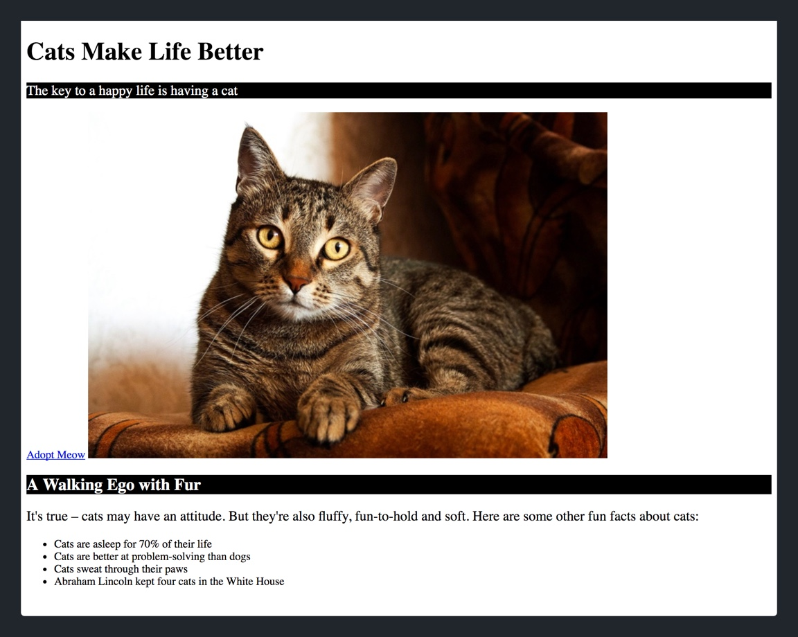

This should give you an idea of the benefits of creating classes. Classes and class selectors allow you to create re-usable CSS rules that can be easily applied to multiple HTML elements. In our case, we applied an `inverted-colors` class to both a `<p>` and `<h2>` element.

## ID Selectors

The last common selector that we'll cover in this section is the ID selector. The syntax and structure for implementing a ID selector is almost identical to the class selector. However, there's one key difference.

Classes can be applied to multiple HTML elements. Each ID needs to be unique and only added to one element in your HTML doc.

Let's take a look:

```
<tagName id="example-id">Insert some content here...</tagName>
```

Here's an example of adding an ID attribute of `example-image` to an image tag:

```

```

The name of the id is `example-image`. We can use this as a selector in our stylesheet:

```
#example-image {
  border-radius: 25px;
  border: 5px solid orange;
}
```

The ID selector must be preceeded by the hashtag `#`. This syntax is how you specify that the CSS rule selector is an ID selector.

To see it in action, let's implement our new ID selector.

> [action]
>
Implement `#example-image` in `style.css`:
>
```
#example-image {
  border-radius: 25px;
  border: 5px solid orange;
}
```

<!-- break -->

> [challenge]
>
We'll also need to update our `` element in our `index.html` to include it's corresponding ID attribute. Add an ID attribute to the `` element in our HTML doc with the value `example-image`.

<!-- break -->

> [solution]
>
You should have added the `#example-image` id to the `` element like so:
>
```

```

When you refresh your browser, you should see the following:

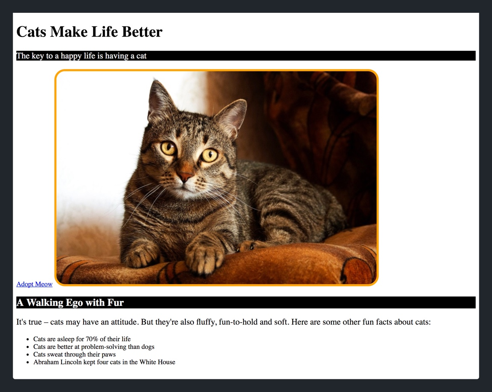

The implementation for classes and id is almost exactly the same. Remember, the key difference between the two selectors is that classes can be applied to multiple HTML elements and IDs can not. If you give one HTML element an id with a name `example-image`, you can *not* give another element an ID with the same name. Each ID should be unique!

As a general rule of thumb, it's better to use classes whereever possible.

> [challenge]
>
Create a new ID attribute for the first `<li>` element named `unique-list-item`. Then add a new CSS rule that changes the `color` property to the hex color value of `#007CED`.

<!-- break -->

> [solution]
>
In your `index.html`, you should have added the following ID to your first list item:
>
```
<li id="unique-list-item">Cats are asleep for 70% of their life</li>
```
>
In your `style.css` you should add the following:
>
```
#unique-list-item {
  color: #007CED;
}
```
>
After refreshing your browser, your landing page should look like the following:
>


# Back to Scratch

It's true, we've started styling the HTML elements in `index.html`. But it's also true that our current styling looks nothing like our final designs.

This is because many of the CSS rules in our final design are more subtle and harder to see. We made the styling in this first iteration bright and outlandish to make it easy to see the effects of each CSS rule that we added.

But now that we've learned how to write CSS, it's time to delete what we have so far and begin slowly implementing the CSS for our actual landing page designs.

> [action]
>
Delete all the classes, ids and CSS that we've written so far:
>
1. In `style.css`, delete all the current CSS that we've written so far. When you're done, your stylesheet should be empty.
1. In `index.html`, delete all of the classes and IDs that we previous added. You should delete the following: `unique-list-item`, `example-image`, `inverted-colors`.
>
When you're finished, `style.css` should be empty and your `index.html` should have no classes or ID attributes:
>
```
<!DOCTYPE html>
<html>
>
<head>
  <meta charset="utf-8">
  <title>Cats – The Internet's Favorite Animal</title>
>
  <link rel="stylesheet" href="css/style.css">
</head>
>
<body>
  <h1>Cats Make Life Better</h1>
  <p>The key to a happy life is having a cat</p>
  <a href="https://www.sfspca.org/adoptions/cats">Adopt Meow</a>
>
  
>
  <h2>A Walking Ego with Fur</h2>
  <p>It's true – cats may have an attitude. But they're also fluffy, fun-to-hold and soft. Here are some other fun facts about cats:</p>
>
  <ul>
    <li>Cats are asleep for 70% of their life</li>
    <li>Cats are better at problem-solving than dogs</li>
    <li>Cats sweat through their paws</li>
    <li>Abraham Lincoln kept four cats in the White House</li>
  </ul>
>
</body>
>
</html>
```

In the next section, we'll learn about the most common CSS property names and their values. We'll use this knowledge to start building towards the final designs of our landing page.
