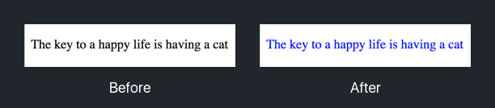
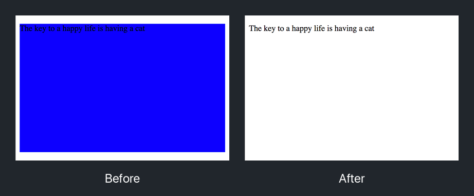
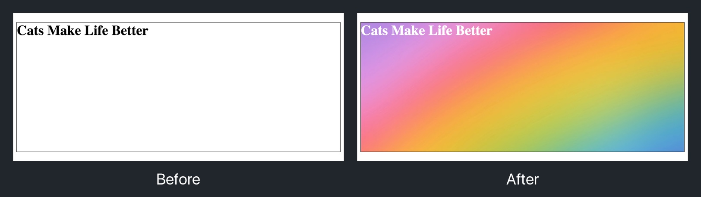
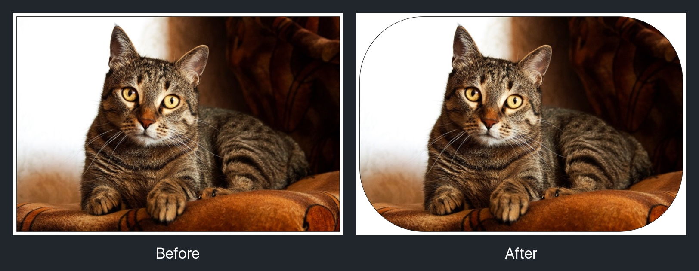
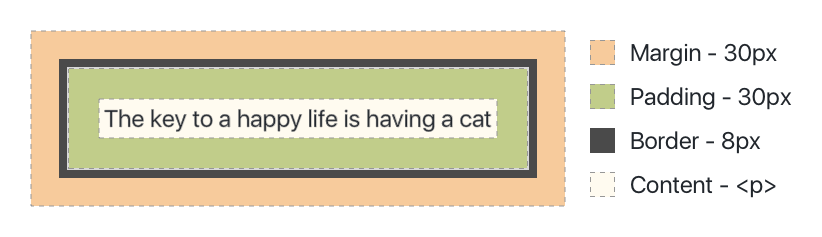
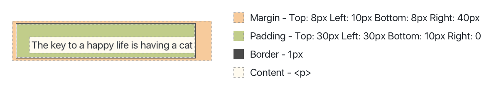
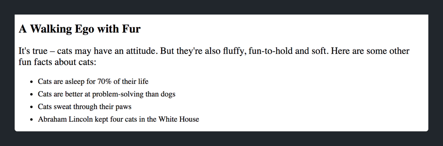

We've covered a few CSS properties now. In this section, we'll start to dive more in-depth on common CSS properties that you'll use to style HTML.

We'll cover the following properties and their values:

1. Color
1. Font Size
1. Background Color
1. Background
1. Height/Width
1. Box Model (Margin/Padding)
1. Border
1. Border Radius

Keep in mind there are many more CSS properties available. However, we'll focus on the most common ones to build a solid foundation first.

> [info]
>
If you don't remember one of the CSS properties, or want to see if another one exists, Google is your friend. Even the most experienced programmers use resources like Google and [StackOverflow](www.stackoverflow.com) to figure out solutions daily.

### Color

Perhaps the most common property is `color`. You've already used this property multiple times in the previous section. As you might recall, the color property allows us to specify the text color of an HTML element. This applies to any HTML element that has text content including <h1>-<h6>, <p>, <a> and more.

There are multiple valid formats for color values, however the most common are hex values, rgba and named colors.

```
/* Hex Value */
color: #000000;

/* RGBA */
color: rgba(0, 0, 0, 0.3);

/* Named Colors */
color: black;
```

1. Hex Values – Most commonly used for defining colors in your CSS
1. RGBA - Allows you to create colors that have an alpha value (or opacity)
1. Named Colors - Easiest to use but don't give a lot of control over color

To give a <p> element blue text, we could add the following CSS rule:

```
p {
  color: blue;
}
```

This is how our <p> element would be displayed in our browser:



Now it's your turn. 

> [challenge]
>
Set the text color of <h1> and <h2> elements to the color black, or #000000.

<!-- break -->

> [solution]
>
In `style.css`, you should have added the following CSS rules:
>
```
h1 {
  color: #000000;
}
>
h2 {
  color: #000000;
}
```

### Font-Size

The `font-size` property allows us to change the size of the font for any text based content. This includes <h1>-<h6>, <p>, <a> and more.

There are a couple different ways to specify the value of `font-size`. In this tutorial, we'll focus on the most basic unit: pixel (px).

If we wanted our anchor tags to have a font size of 48px, we could write the following CSS rule:

```
a {
  font-size: 48px;
}
```

In our browser:

[Font Size Property](assets/font_size_property.png)

For our practice, let's change the font size of our <h1> section heading and <p> element.

> [challenge]
>
Add the following two CSS rules:
>
1. Set the <h1> element to have a font size of `36px`
2. Set the <p> element to have a font size of `20px`

<!-- break -->

> [solution]
>
You should have the following two rules in your stylesheet:
>
```
h1 {
  color: #000000;
  font-size: 36px;
}
>
p {
  font-size: 20px;
}
```

### Background Color

The `background-color` property allows you to set the background color of an HTML element. Just like text color, the value of this property can be a hex value, rgba or named color.

The background color can be set like so:

```
h1 {
  background-color: #FFB300;
}
```

In the browser:


### Height/Width

The `height` and `width` properties specify the height and width of a HTML element respectively. There are many different values you can apply to both of these properties, but for this tutorial we'll focus on pixels (px) and percentages (%).

Let's see it in action:

```
p {
  background-color: blue;
  height: 250px;
  width: 500px;
}
```

> [info]
>
We've added a background color to our HTML element to make it easier to see the height and width of the element.



We can also supply percentages (%) as values for our `height` and `width` properties. The percentage is in relation to the height or width property of the parent element.

> [info]
>
The _parent_ element refers to the element that the HTML element is contained within. In this case, all of our HTML are contained within the <body> element. This will change soon once we start learning about the <div> element.

### Border

The `border` property allows you set a border for your HTML element. We can create a border around our  element with the following syntax:

```
img {
  border: 5px solid #FF6DBA;
}
```

The first value `5px` is the width of the border.

The second value `solid` describes the type of border you want. Other options include `dashed` and `dotted`.

The last value is the color of the border, in this case `#FF6DBA`.

In our browser:


### Background Image

The `background-image` property allows us to add a background image to an HTML element. This is similar to the background color, however an image is shown instead of a color. 

Let's look at the syntax:

```
h1 {
  height: 300px;
  color: white;
  background-image: url("../img/rainbow_bg.jpg");
}
```

> [info]
>
We've added some additional declarations in our CSS rule to make it easier to see the effects of the `background-image` property.

In the browser:



Our background image is a rainbow that fills the background of our <h1> element. You can see the height and width or the <h1> element through the edges of the border.

### Border-Radius

The `border-radius` property allows you to add rounded corners of a HTML elements. This can be especially useful for adding rounded corners to buttons and images.

In action, if we wanted to round the corners of an  element, we could add the following in our stylesheet:

```
img {
  border: 1px solid black;
  border-radius: 25px;
}
```

The before and after in our browser:



As you can see, after applying the border radius, the corners of our image are now rounded.

### The Box Model

When a browser displays your HTML elements, each element is displayed as a rectangular box. CSS is then applied to the box to style the HTML element.


The box model refers to the box layout of each HTML element. Each box consists of the following:

1. Content - The actual content (text, images) of the HTML element.
1. Padding - Defined by the `padding` property. In-between the border and content of an element. Is transparent.
1. Border - Defined by the `border` property. Surrounds the padding and content of an element.
1. Margin - Defined by the `margin` property. Adds space between the border and other HTML elements. Is transparent.

Let's see what this looks like for our <p> element:



The `margin` and `padding` properties allow us to customize the position of the content for our HTML element. In the illustration above, we give both our margin and padding a value of 35px, but in your designs you can give each one any value you specify. In addition, the margin/padding of each edge can be different.



In this example, we have different values for the margin and padding of each edge.

If we want to add a margin or padding for a specific edge we can use the following CSS property names:

- `margin-top`
- `margin-left`
- `margin-bottom`
- `margin-right`
- `padding-top`
- `padding-left`
- `padding-bottom`
- `padding-right`

> [info]
>
It's also important to note that the both margin and padding are transparent, or clear.

By using `margin` and `padding`, we can position each of our HTML elements relative to each other.

Let's try it now.

> [challenge]
>
Add a margin to the bottom of each <li> element of 8px.

<!-- break -->

> [solution]
>
You should've added the following code to your stylesheet:
>
```
li {
  margin-bottom: 8px;
}
```

After refreshing your landing page in your browser, you should see more space between each <li> element.



# Moving Forward

Throughout this tutorial, the CSS properties we learned in this section will be our bread and butter for styling our web page. Feel free to come back for reference on common CSS properties and how to use them.

## One Last Challenge

Before we move on, let's put your skills to the test. We'll combine a few different properties that you'll need to implement by yourself. Let's do it!

> [challenge]
>
Add a CSS rule that targets the unordered list element and sets the following declarations:
>
- Background Color with Hex Color of `#F7F9FC`
- Margin on the Top Edge of 25 pixels
- Top and Bottom Padding of 30 pixels
- Left and Right Padding of 55 pixels
- Rounded Corners with a Radius of 8 pixels

<!-- break -->

> [solution]
>
Check your solution below:
>
```
ul {
  background-color: #F7F9FC;
  margin-top: 25px;
  padding: 30px 55px;
  border-radius: 8px;
}
```

We're well in the depths of front-end development. So far, we've learned about building our content with HTML elements and how to style them with CSS. In the next section, we'll learn about the <div> element that allows us to group HTML elements into chunks.
