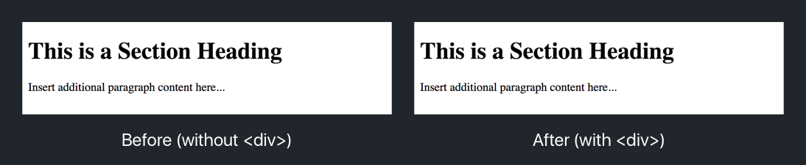
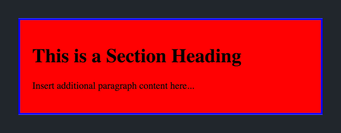
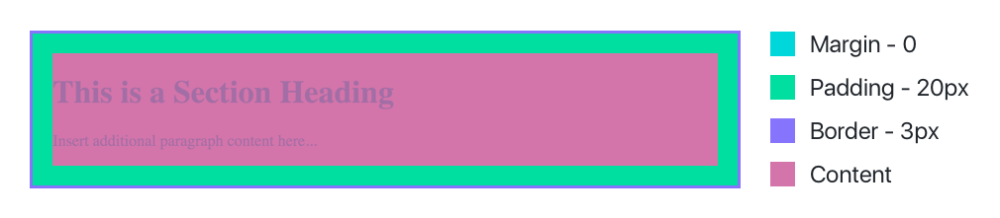
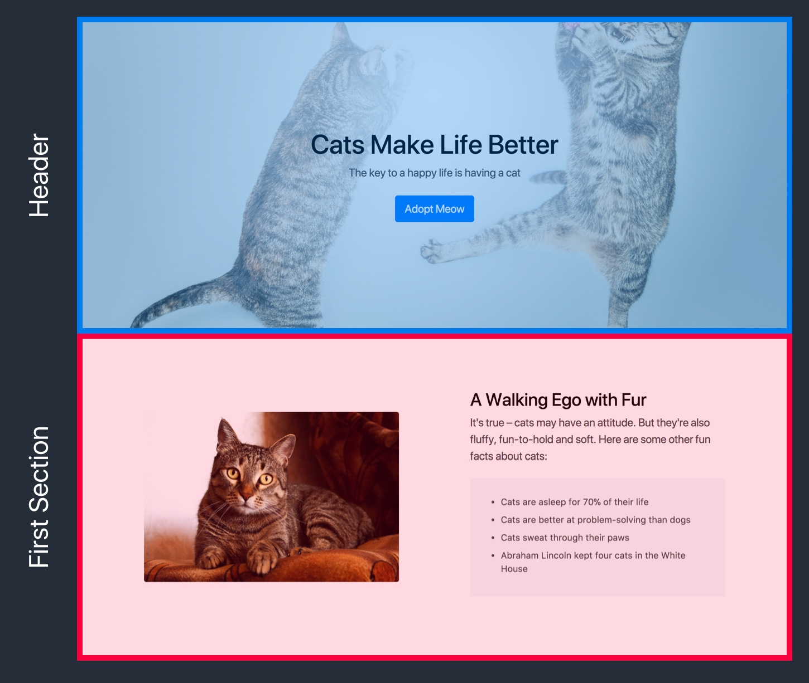
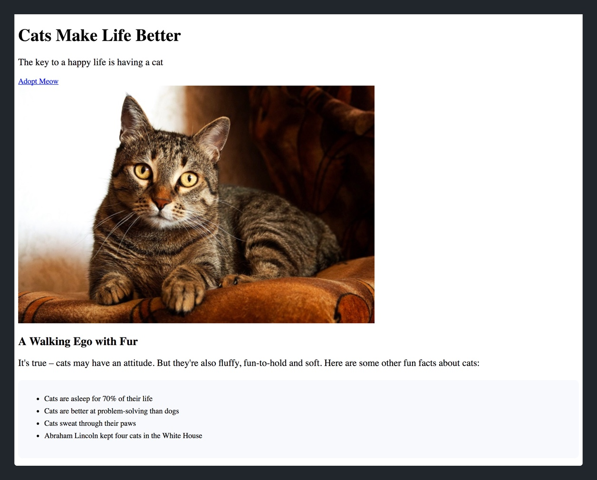
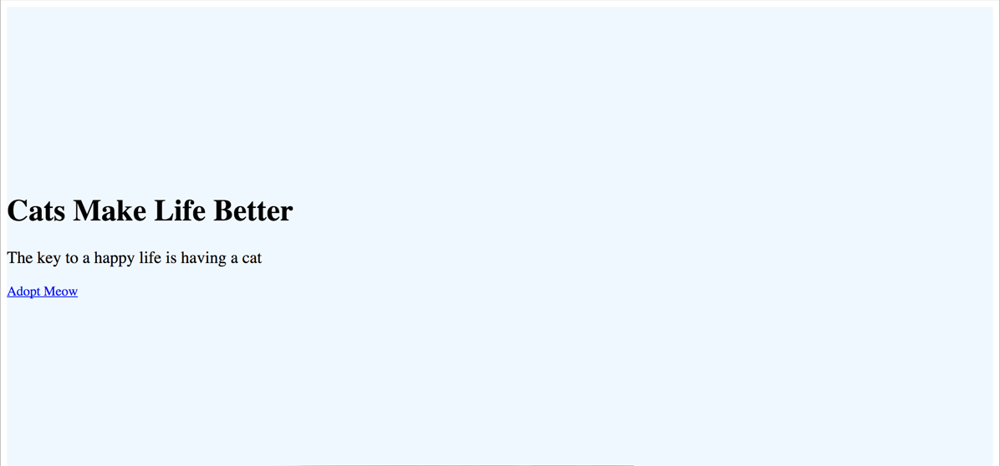
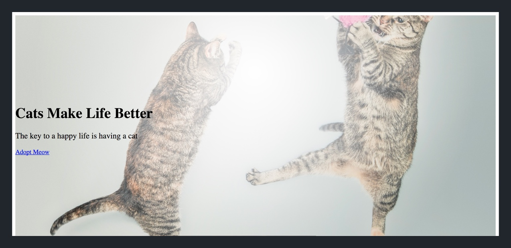
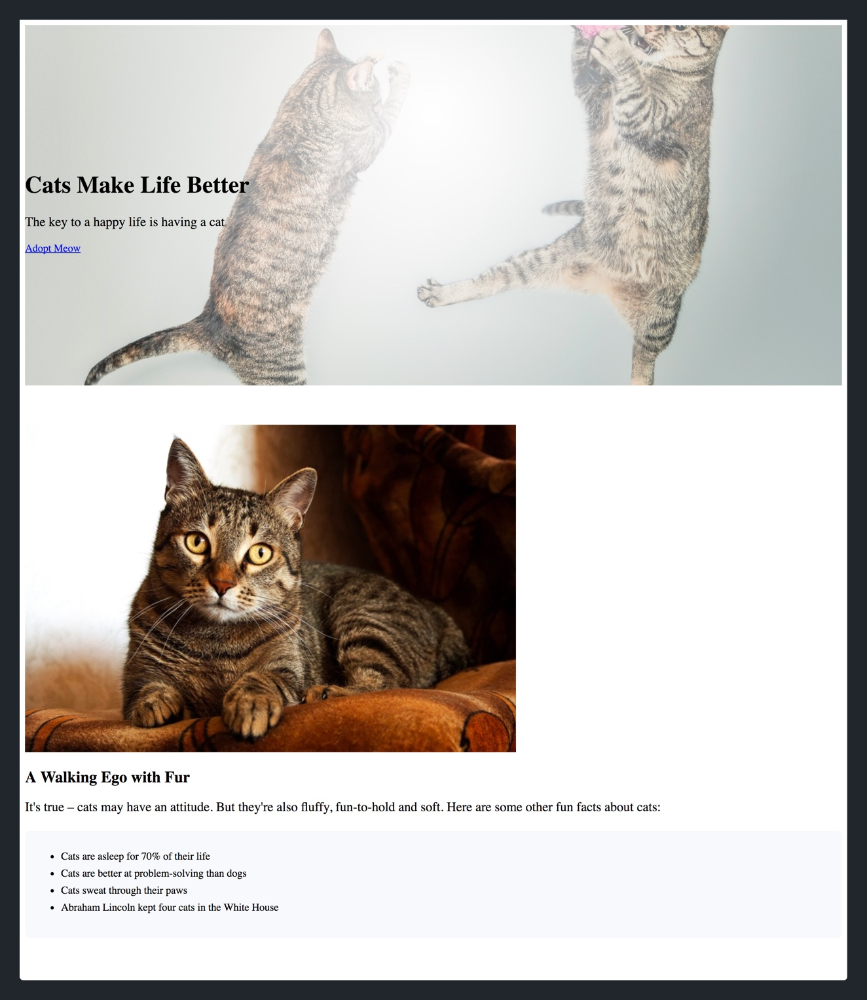

Up to this point, all of the HTML elements we've added are contained within the opening and closing `<body>` tags in our HTML document. In this section, we'll learn how to group related elements into _containers_.

But why would we want to group our HTML content into _containers_?

Grouping our HTML content in containers makes it easier for us to target our elements with class and id selectors. This, in turn, makes it easier for us to position and style HTML via CSS.

Let's look at our bread and butter for grouping HTML content: the `<div>` tag.

> [info]
>
There are a number of additional tags that allow us to group related HTML content together. Some examples include `<header>`, `<section>`, `<article>` and `<footer>`. All of these HTML elements (including `<div>`) have no effect on the HTML content itself, but instead group and contain other elements. In this tutorial, we'll cover `<div>`, `<header>` and `<footer>`.

# The Content Division Element

The `<div>` tag is used to group other HTML content together. The `<div>` element doesn't add or change the content of your HTML. Instead, it's main purpose is to provide an easy way to target and each group.

## Creating a <div>

To create a new `<div>`, we simply surround groups of HTML elements with an opening and closing `<div>` tag.

```
<div>
  <h1>This is a Section Heading</h1>
  <p>Insert additional paragraph content here...</p>
</div>
```

If we look in the browser, you'll notice that the HTML content doesn't change at all:



However, if we add a class attribute to our `<div>`, we're able to see the dimensions of the container.

HTML:

```
<div class="example-div">
  <h1>This is a Section Heading</h1>
  <p>Insert additional paragraph content here...</p>
</div>
```

CSS:

```
.example-div {
  background-color: red;
  border: 3px solid blue;
  padding: 20px;
}
```

When we're done, you can see our `<div>` and it's content displayed in the browser like so:



Notice how we're able to use the `margin` and `padding` properties of our containing `<div>` to position the elements within. In this case, add 20 pixels of padding between each edge of the `<div>` and it's content.



> [info]
>
Grouping HTML elements with `<div>` tags also makes it much easier to specifically target elements container within. We'll learn more about more complicated selectors in the upcoming section.

## Grouping our Elements

Let's go ahead and start grouping the HTML elements in `index.html` into thier respective `<div>` tags.

> [challenge]
>
Looking at the design below, group the appropriate HTML elements of our header into one `<div>` and the element of our first section into another.
>


Once you've attempted the challenge, check your solution below.

> [solution]
>
You should have two separate opening and closing `<div>` tags that group the HTML elements from each respective section within:
>
```
<body>
  <!-- header -->
  <div>
    <h1>Cats Make Life Better</h1>
    <p>The key to a happy life is having a cat</p>
    <a href="https://www.sfspca.org/adoptions/cats">Adopt Meow</a>
  </div>
>
  <!-- first section -->
  <div>
    
>
    <h2>A Walking Ego with Fur</h2>
    <p>It's true – cats may have an attitude. But they're also fluffy, fun-to-hold and soft. Here are some other fun facts about cats:</p>
>
    <ul>
      <li>Cats are asleep for 70% of their life</li>
      <li>Cats are better at problem-solving than dogs</li>
      <li>Cats sweat through their paws</li>
      <li>Abraham Lincoln kept four cats in the White House</li>
    </ul>
  </div>
</body>
```
>
Notice that each opening and closing `<div>` tag contains it's group of related elements. This will make it easier for us to use CSS position and style each division.

> [action]
>
Refresh your landing page in your browser. You should see the following:
>

>
Not much has changed, because the `<div>` tag is only used to group elements together. However, one thing to notice is that the cat image and the CTA button are no longer on the same line. This is because the `<div>` element is a block element and unless otherwise specified, will force content onto separate lines.

# The Header Element

We've grouped our header and first section into their respective `<div>` containers. However, there's a better container element that's more appropriate for our header content. Can you guess it's name?

That's right. The `<header>` tag is used to contain introductory content such as your product's main heading and tagline.

Similar to the `<div>` element, the `<header>` element doesn't change the layout or style of the HTML itself. Let's go ahead and replace the first `<div>` element with a `<header>` element instead.

> [challenge]
>
Replace the header section's `<div>` element with a `<header>` element.

<!-- break -->

> [solution]
>
Afterwards, your header HTML content should look like so:
>
```
<header>
  <h1>Cats Make Life Better</h1>
  <p>The key to a happy life is having a cat</p>
  <a href="https://www.sfspca.org/adoptions/cats">Adopt Meow</a>
</header>
```

If you refresh your landing page, nothing will change. But this sets us up nicely to begin styling with CSS. Next, let's add some pizazz to our container elements.

# Adding Style to our Containers

With our new `<header>` amd `<div>` elements, let's begin adding some CSS.

> [challenge]
>
In `style.css`, add the following declarations for the `<header>` element:
>
- Background Color: `#F0F8FF`
- Padding Top and Bottom: `200px`
- Padding Left and Right: `0`

When you're done, check your solution below:

> [solution]
>
We can target our `<header>` element and add the following declarations like so:
>
```
header {
  background-color: #F0F8FF;
  padding: 200px 0;
}
```

Refresh your landing page in your browser and you should see the following:



Positioning wise, looks a little more like our final designs. Next, let's work on adding a background image to our header.

## Setting a Background Image

To set our background image, there's a multitude of declarations we'll need to set. Before we start, you'll need to download the `jumping_cats.jpg` image and place it inside our `img` folder.

> [action]
>
Download our header's background image by [clicking here.](https://www.dropbox.com/s/2278f4u5rkbhoy3/jumping_cats.jpg?dl=1) After the download completes, move the image asset into the `img` folder of our project.

Next, we'll need to add some CSS to set our background image for our `<header>`.

> [action]
>
In our stylesheet, add the additional declarations to our header selector:
>
```
header {
  // ...
>
  background-image: url("../img/jumping_cats.jpg");
  background-size: cover;
  background-position: center center;
  background-repeat: no-repeat;
}
```

We've already learned about the `background-image` property. The other properties that we added configure the size and positioning of our background image.

> [action]
>
Once you're finished, refresh your landing page in your browser and you should see the background image appear.
>


It doesn't look exactly like our final design yet, but we're getting warmer. Let's move on to styling our first section `<div>`.

## Styling our First Section

Unfortunately, our first section won't start looking like our final designs until we learn about Bootstrap's grid system. For now, we'll start by adding basic properties that help move it in the right direction.

First, let's create a class attribute for our first section so we can select it in our stylesheet.

> [challenge]
>
Add a new class attribute for our first section's container `<div>` named `first-section`.

<!-- break -->

> [solution]
>
Your `<div>` should now have the following class:
>
```
<div class="first-section">
  <!-- ... first section content -->
</div>
```

<!-- break -->

> [info]
>
To target `<div>` elements, you can use class or id selectors. In most cases, it's better to use class selectors because they encourage the mindset of building re-usable CSS throughout your stylesheets. If you're interested reading more in-depth on the topic, check out this [article.](http://oli.jp/2011/ids/)

Next, let's give our first section a background color.

> [challenge]
>
Give the first section `<div>` a background color of `white`.

<!-- break -->

> [solution]
>
In your stylesheet:
>
```
.first-section {
  background-color: white;
}
```
>
We target the `.first-section` class and add a declaration to give it a white background. Nothing should change because the background should already be white (by default.) We're just making more explicit.

Last, we'll create a re-usable class that we'll use to position each of our landing page's sections. We'll start by creating the CSS rule in our stylesheet.

> [challenge]
>
Create a CSS rule with a class selector named `section` that adds a top padding of `60px` and a bottom padding of `40px`.

<!-- break -->

> [solution]
>
In your stylesheet, you should have added the following CSS rule:
>
```
.section {
  padding: 60px 0 40px;
}
```

After creating our `.section` CSS rule, we can add the class selector to our `<div>` element.

> [action]
>
Add the `section` class to the `<div>` element of our first section:
>
```
<div class="section first-section">
  <!-- ... first section content -->
</div>
```
>
Notice that we can add multiple classes just by separating each class with a space in our class attribute.

Refresh our landing page and take a look at our progress.



# Moving On

In this section, we learned about grouping our HTML content into related chunks using container elements like `<div>` and `<header>`. This will become especially important as we continue to style our HTML with CSS.

In the next section, we'll learn more about CSS and how to use inheritance and CSS specificity to write better (more re-usable and maintainable) CSS.
