Since it's creation, one of the most defining and useful features of Bootstrap is its grid system. Bootstrap's grid system provides an easy way for developers to lay out HTML elements in a 12-column grid.


In this section, we'll learn to use Bootstrap's grid system to position the content in our landing page. In addition, we'll dive into responsiveness and how to adjust our HTML styling for various screen sizes.

# Implementing a Grid

To use the grid, there's some setup that we'll need in our HTML. To start, each grid needs to be wrapped within a `<div>` with Bootstrap's [container class](http://getbootstrap.com/docs/4.0/layout/overview/#containers).

The container defines how large the width of our grid will be (the span of the screen that your content can potentially cover.)

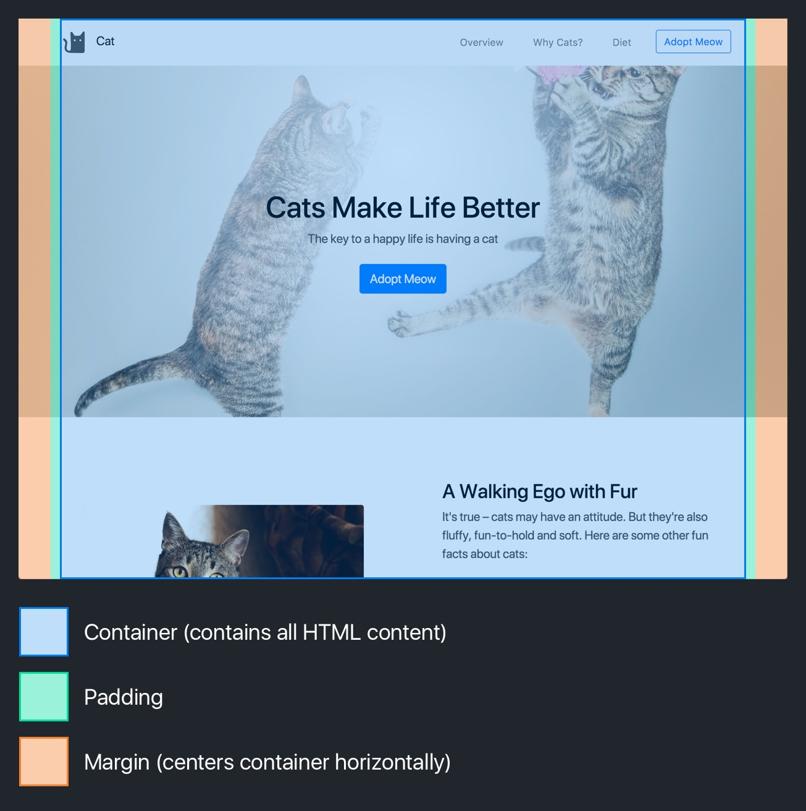

One main benefit of using a container is that if the device's screen is too wide, the content will still be positioned and centered within a fixed-width container. This ensures that our content will stretch and shrink appropriately on devices with different screen widths.

> [info]
>
If we want to create a container that takes up the full width of the device's screen, there's is the `.fluid-container` class. We won't cover this class in this tutorial, but the implementation is exactly identical to using the `.container` class. The only difference is the area that the HTML content will cover in your browser.

## Creating a Container

Creating a container is easy, we can simply create a new `<div>` element with the `.container` class. Remember, this is a container element that will "contain" all of our HTML content.

To create a new Bootstrap `.container`:

```
<div class="container">
  <!-- ... insert HTML content -->
</div>
```

Let's go ahead and implement a Bootstrap container for our `<header>`.

> [challenge]
>
In `index.html`, create a new Bootstrap container within your `<header>` element.

<!-- break -->

> [solution]
>
In `index.html`, within your `<header>` element, modify your code to the following:
>
```
<header class="text-center">
  <div class="container">
    <!-- ... existing HTML content -->
  </div>
</header>
```
>
We've added our first container, but this is just the start for implementing a grid.
>
You might be wondering why we didn't simply add the `.container` class to our `<header>` element instead of creating a new `<div>` element. This is because we want the background image for our `<header>` to cover the entire width of the browser. Otherwise the _background image_ property we added to our `<header>` would only cover the span of our container like so:
>
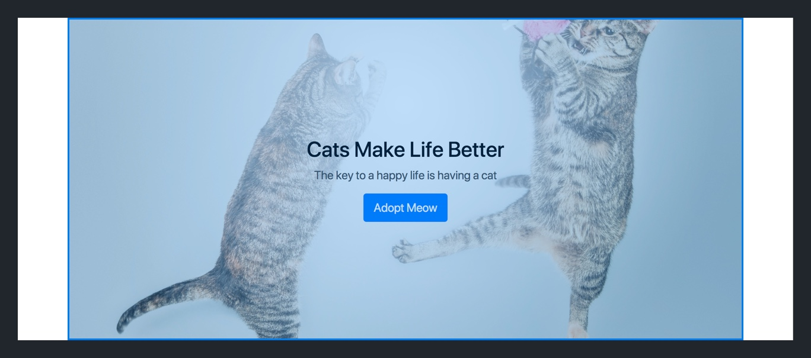
>
Notice how the background image only spans the content of the `.container` and doesn't cover the entire browser window. This is why we place our `.container` `<div>` within another parent `<header>` element.

## Adding Rows and Columns

Within each `.container`, we can begin implementing our grid. The Bootstrap grid system is made up of rows and columns.

First, we'll need to add a row:

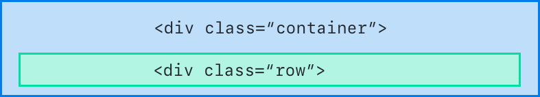

```
<div class="container">
  <div class="row">
    <!-- ... insert HTML content -->
  </div>
</div>
```

As the name implies, each row represents a horizontal row. We can add multiple rows within a single container:

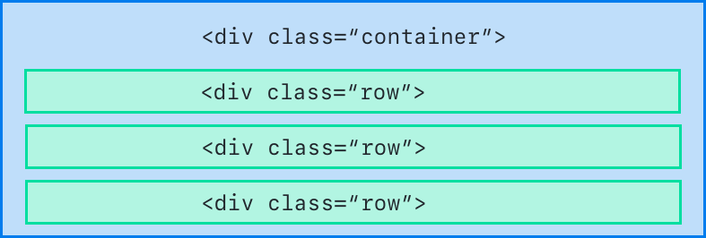

```
<div class="container">
  <div class="row">
    <!-- ... insert HTML content -->
  </div>

  <div class="row">
    <!-- ... insert HTML content -->
  </div>

  <div class="row">
    <!-- ... insert HTML content -->
  </div>
</div>
```

Within each row `<div>`, we have access to a 12-column grid system.

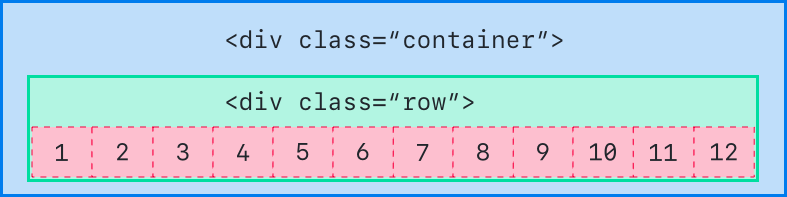

We'll need to add another `<div>` element with the number of columns we want each column to take up for each one. In the case above, we want each column to take up a space of 1 column:

```
<div class="container">
  <div class="row">
    <div class="col-1">1</div>
    <div class="col-1">2</div>
    <div class="col-1">3</div>
    <div class="col-1">4</div>
    <div class="col-1">5</div>
    <div class="col-1">6</div>
    <div class="col-1">7</div>
    <div class="col-1">8</div>
    <div class="col-1">9</div>
    <div class="col-1">10</div>
    <div class="col-1">11</div>
    <div class="col-1">12</div>
  </div>
</div>
```

Each individual column can also take up multiple column spaces:

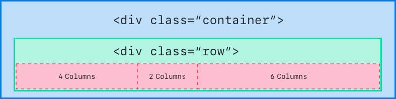

```
<div class="container">
  <div class="row">
    <div class="col-4">4 Columns</div>
    <div class="col-2">2 Columns</div>
    <div class="col-6">6 Columns</div>
  </div>
</div>
```

Notice in the both examples, we gave each column `<div>` a class name of `col-{column-size}`. The column-size defines how many columns the `<div>` will cover.

Using this combination of containers, rows and varying width columns, we can begin to position our HTML elements in various layouts without needing to worry about writing too much CSS.

## Auto-layout Columns

The Bootstrap grid is also smart enough to layout content without explicitly numbering the size of each column. We'll take a look at two examples of using Bootstrap to automatically calculate the proper column size.

### Equal Width

If we omit the column size to the end of the `col-{column-size}` class and replace it with a `.col` class, Bootstrap will automatically calculate the size of each column by giving each `<div>` within the row an equal width.

> [challenge]
>
For example, if our code is the following, what will be the column size of each column?
>
```
<div class="container">
  <div class="row">
    <div class="col">? Columns</div>
    <div class="col">? Columns</div>
    <div class="col">? Columns</div>
  </div>
</div>
```

<!-- break -->

> [solution]
>
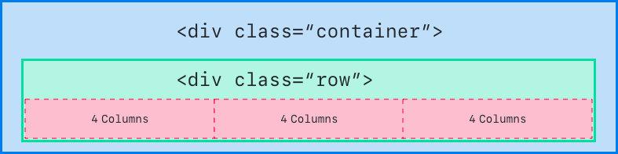
>
Because the grid system has 12 columns by default, each column will have an equal column width of 4 columns. In this example, you can see how you can use `.col` to dynamically size columns to have equal widths.

### Setting One Column Width

Another useful feature to know about is the ability to set the column width of one column and have Bootstrap auto-layout the column widths for the remaining columns.

To do so, we can simple set a explicit column width for a single column `<div>` and leave the remaining `<div>` with the `.col` class. Bootstrap will subtract the explict width and use the remaining width of the grid to determine the size of each column.

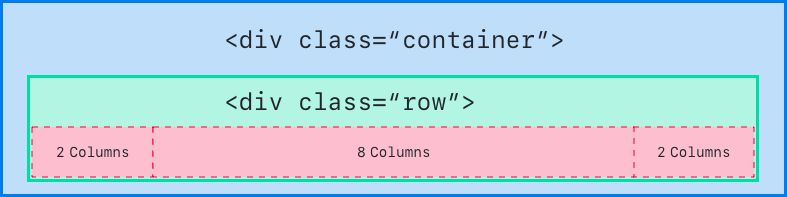

```
<div class="container">
  <div class="row">
    <div class="col">2 Columns</div>
    <div class="col-8">8 Columns</div>
    <div class="col">2 Columns</div>
  </div>
</div>
```

As you can see above, we set the column width to be explicitly `.col-8` for one of our `<div>` columns. The other two surround columns are automatically calculated by Bootstrap to fill the remaining grid space. In this case, both outer columns have a column width of 2.

## Refactoring Our Header

To bring all of it together, we're going to finish refactoring the rest of our `<header>` and it's children elements to utilize the Bootstrap grid system. Refactoring means that we'll keep the functionality the same, while improving the code. Visually nothing will change, but it'll give us some much needed practice with implementing a grid.

> [challenge]
>
In `index.html`, use what we learned about grids to modify the existing code to use Bootstrap's grid system.

<!-- break -->

> [solution]
>
In `index.html`, modify your `<header>` to the following:
>
```
<header>
  <div class="container">
    <div class="row">
      <div class="col text-center">
        <h1>Cats Make Life Better</h1>
        <p>The key to a happy life is having a cat</p>
        <a class="btn btn-primary btn-lg" href="https://www.sfspca.org/adoptions/cats">Adopt Meow</a>
      </div>
    </div>
  </div>
</header>
```
>
We modified our code by implementing Bootstrap's grid system. We only used 1 column that was given the full width of the entire grid using Bootstrap's auto-layout feature.

<!-- break -->

> [info]
>
You might be thinking, using Bootstrap's grid system requires a lot of extra `<div>` elements and nesting. That's actually one of the biggest criticisms of the front-end framework. Although it makes it _easier_ to layout our content, it also clutters our HTML with many `<div>` elements making our HTML harder to read and understand.

Before you move on, refresh your landing page in your browser. You should see the following:

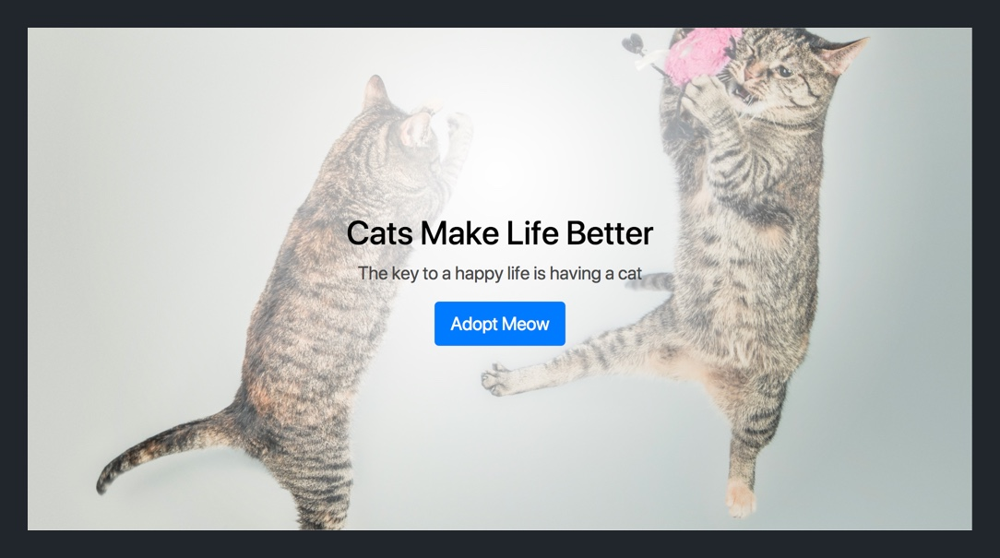

# Implementing the Layout for our First Section

Adding a grid system to our landing page header was relatively easy. That's because our layout was pretty straightforward–we just had to center all of the HTML content horizontally.

Next, we'll move onto a more complicated layout that requires 2 columns instead of just 1. In addition, our layout will even changes depending on the width of the screen. 

Let's review the design of our first section:

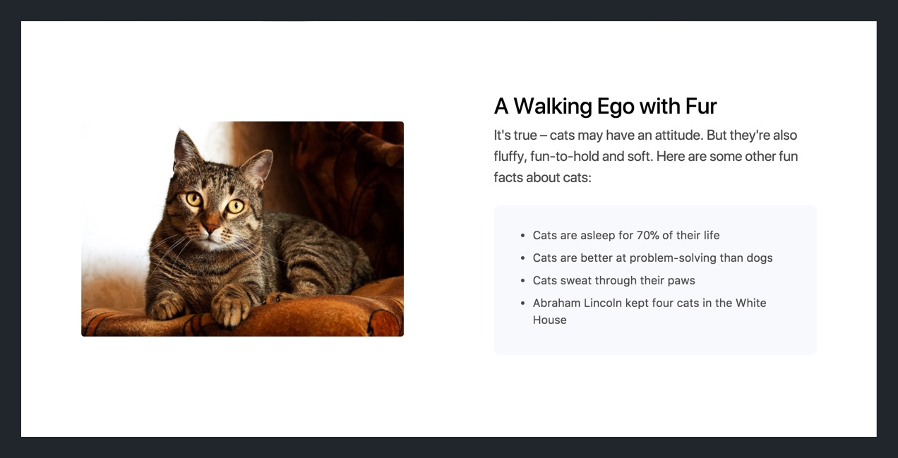

Notice that our content will be broken up into one row with two columns:

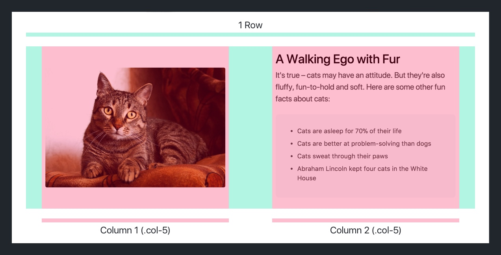

Note that both columns will have a width of 5 columns.

## Grid Setup

Let's start with the boilerplate code for setting up our grid. We'll need to create a `.container` and `.row` so we can start placing our HTML content within columns.

> [challenge]
>
In `index.html`, modify the HTML for your first section so that it's placed within a `.container` and `.row` `<div>` elements.

<!-- break -->

> [solution]
>
After adding a `.container` and `.row` `<div>`, the HTML for your first section should look like the following:
>
```
<div class="section first-section">
  <div class="container">
    <div class="row">
>
      <!-- ... existing HTML content -->
>
    </div>
  </div>
</div>
```

With a `.container` and `.row`, we can begin dividing our content into columns.

## Positioning HTML with Columns

We'll use two columns to divide our content in two `.col-5` `<div>` elements:

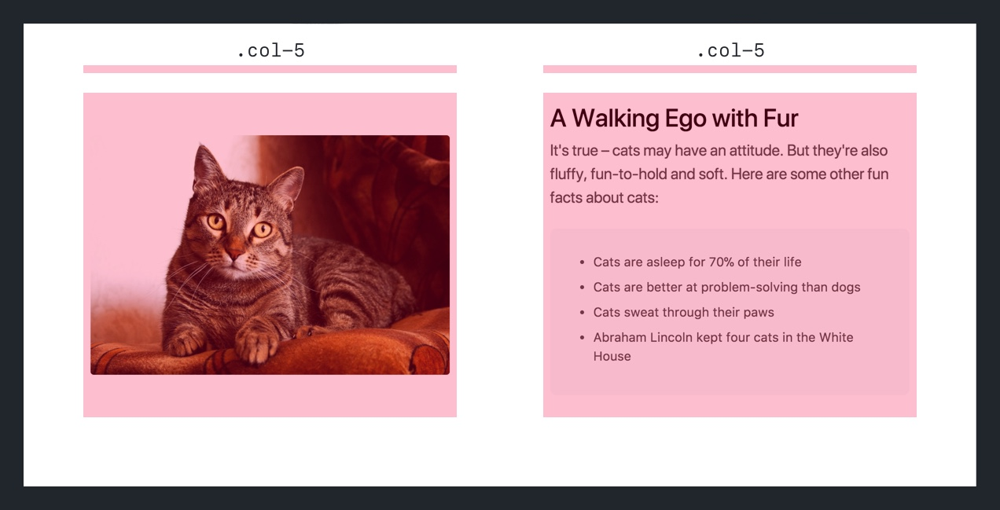

> [action]
>
Separate the HTML elements in your first section into their respective columns. Make sure to give each column a width of `.col-5`:
>
```
<div class="section first-section">
  <div class="container">
    <div class="row">
      <!-- column 1 -->
      <div class="col-5">
        
      </div>
>
      <!-- column 2 -->
      <div class="col-5">
        <h2>A Walking Ego with Fur</h2>
        <p>It's true – cats may have an attitude. But they're also fluffy, fun-to-hold and soft. Here are some other fun facts about cats:</p>
>
        <ul>
          <li>Cats are asleep for 70% of their life</li>
          <li>Cats are better at problem-solving than dogs</li>
          <li>Cats sweat through their paws</li>
          <li>Abraham Lincoln kept four cats in the White House</li>
        </ul>
      </div>
    </div>
  </div>
</div>
```

If you refresh your landing page, you'll see the following:

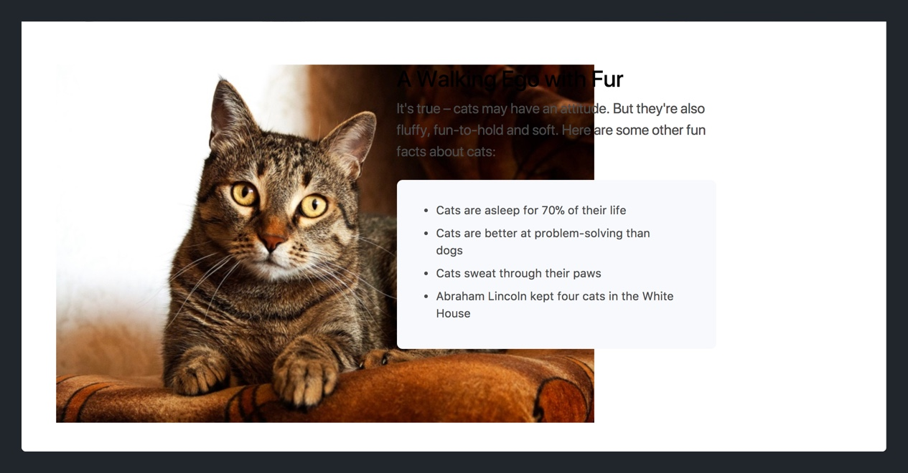

Eek! Not what we want. Currently the size of the image is too large and expanding out of the bounds of the column that we set. To remedy this, we'll use some prebuilt Bootstrap classes for customizing `` elements.

## Sizing Images

To make sure our image only covers the width of the column, we'll use one of Bootstrap's built-in classes for sizing responsive images. You can find the documentation by [clicking here.](https://getbootstrap.com/docs/4.0/content/images/#responsive-images)

> [challenge]
>
Using the [documentation](https://getbootstrap.com/docs/4.0/content/images/#responsive-images), add the class to your `` element so that the image only covers the width of it's column.

Check your solution below!

> [solution]
>
We can make our image responsive by simply adding the `img-fluid` class to our `` element:
>
```

```
>
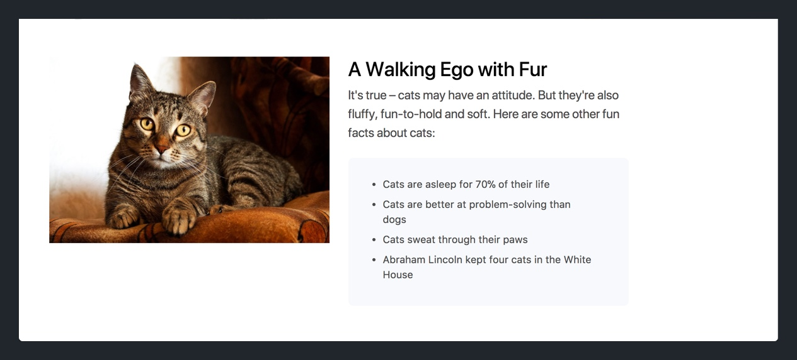

Before we move on, let's make our image a little more snazzy by giving it some rounded corners. We could create a new CSS rule in our stylesheet that targets our `` element, but instead we'll make use of another Bootstrap class.

> [action]
>
In `index.html`, add the following class to the `` element in your first section:
>
```

```

If you refresh the landing page in your browser, you'll see the following:

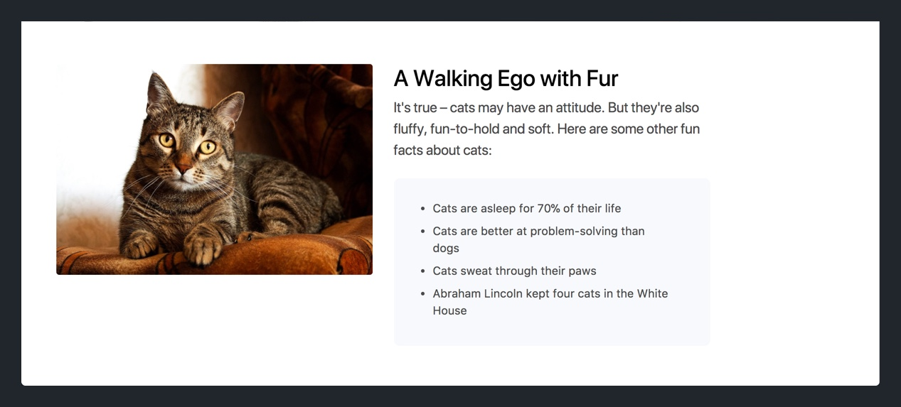

It's definitely going in the right direction of our final design, but the positioning still isn't correct.

Next, we'll look at how to align the columns of our grid using horizontal and vertical alignment.

# Column Alignment

Another feature of the Bootstrap grid system is horizontal and vertical alignment of columns. This is another powerful feature that gives us additional control over how we position our content. We'll start by covering horizontal alignment.

## Horizontal Alignment

Bootstrap's grid system has various options that allow you to align your columns horizontally. The five different alignment options are:

- justify-content-start
- justify-content-center
- justify-content-end
- justify-content-around
- justify-content-between

Let's look at each of these individually and understand how they affect the alignment of columns within a row.

### justify-content-start

`.justify-content-start` aligns all columns to the left most edge.

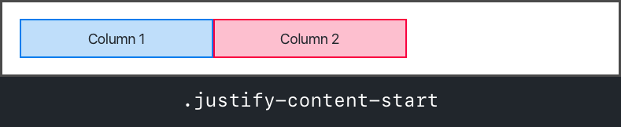

```
<div class="container">
  <div class="row justify-content-start">
    <div class="col-4">
      Column 1
    </div>
    <div class="col-4">
      Column 2
    </div>
  </div>
</div>
```

### justify-content-end

`.justify-content-end` aligns all columns to the right most edge.

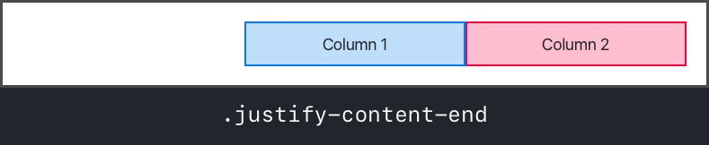

```
<div class="container">
  <div class="row justify-content-end">
    <div class="col-4">
      Column 1
    </div>
    <div class="col-4">
      Column 2
    </div>
  </div>
</div>
```

### justify-content-center

`.justify-content-center` aligns all columns to the center

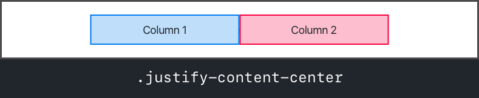

```
<div class="container">
  <div class="row justify-content-center">
    <div class="col-4">
      Column 1
    </div>
    <div class="col-4">
      Column 2
    </div>
  </div>
</div>
```

### justify-content-around

`.justify-content-around` evenly distributes columns within the row with equal space around each column.

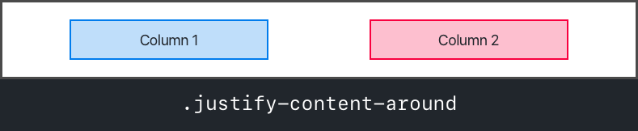

```
<div class="container">
  <div class="row justify-content-around">
    <div class="col-4">
      Column 1
    </div>
    <div class="col-4">
      Column 2
    </div>
  </div>
</div>
```

### justify-content-between

`.justify-content-between` evenly distributes columns within the row with the first column starting at the left most edge and the last column ending on the right most edge.

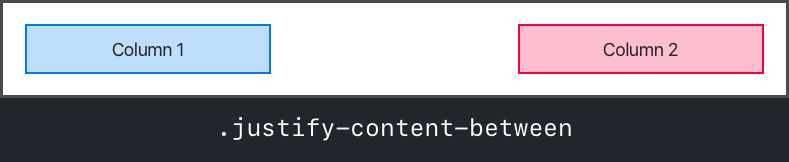

```
<div class="container">
  <div class="row justify-content-between">
    <div class="col-4">
      Column 1
    </div>
    <div class="col-4">
      Column 2
    </div>
  </div>
</div>
```

## Implementing Horizontal Alignment

With our new knowledge of the different types of horizontal alignment, let's try it out! We'll focus on giving the columns in our first section the proper positioning.

> [challenge]
>
In `index.html`, give the columns of our first section a horizontal alignment of `.justify-content-around`.

<!-- break -->

> [solution]
>
You should have added the `.justify-content-around` class to the `.row` `<div>`:
>
```
<div class="row justify-content-around">
  <div class="col-5">
    <!-- ... existing HTML content -->
  </div>
>
  <div class="col-5">
    <!-- ... existing HTML content -->
  </div>
</div>
```

When you're done, refresh your landing page in the browser and you should see the following:

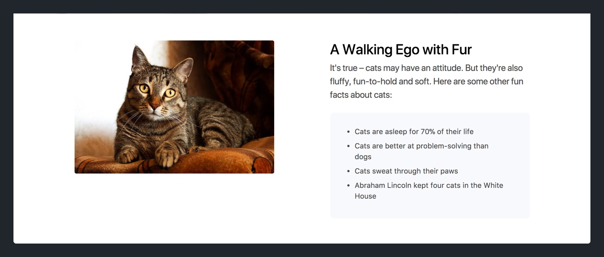

Notice how both columns have equal spacing around each column. Looking a lot better!

## Vertical Alignment

If you look at the current landing page, you'll notice that our cat `` element isn't vertically aligned with the text content on the right side of the first section. 

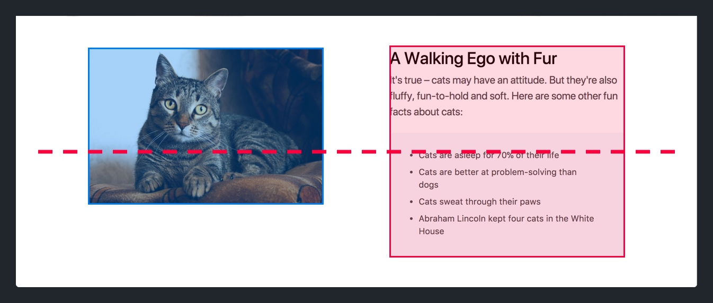

Let's learn about vertical alignment and how to position content vertically within the same row relative to one another.

The 3 different ways you can align your content within a row are as follows:

- align-items-start
- align-items-center
- align-items-end

### align-items-start

`.align-items-start` aligns your columns vertically towards the top of your row.

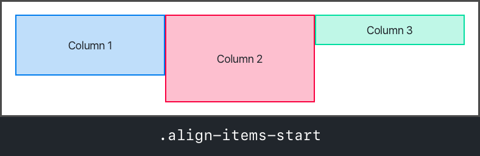

```
<div class="container">
  <div class="row align-items-start">
    <div class="col-4">
      Column 1
    </div>
    <div class="col-4">
      Column 2
    </div>
  </div>
</div>
```
### align-items-center

`.align-items-start` aligns your columns vertically towards the center of your row.

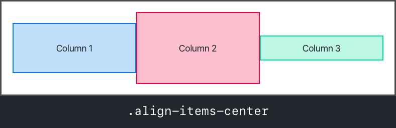

```
<div class="container">
  <div class="row align-items-center">
    <div class="col-4">
      Column 1
    </div>
    <div class="col-4">
      Column 2
    </div>
  </div>
</div>
```

### align-items-end

`.align-items-end` aligns your columns vertically towards the bottom of your row.

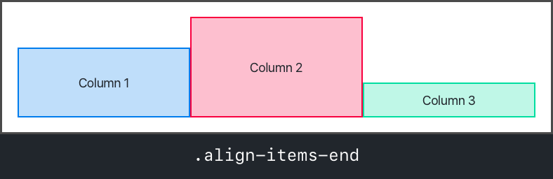

```
<div class="container">
  <div class="row align-items-end">
    <div class="col-4">
      Column 1
    </div>
    <div class="col-4">
      Column 2
    </div>
  </div>
</div>
```

## Implementing Vertical Alignment

Let's go ahead and add some vertical alignment to the columns of our first section.

> [challenge]
>
In `index.html`, give the columns of our first section a vertical alignment of `.align-items-center`.

<!-- break -->

> [solution]
>
You should have added the `.align-items-center` class to the `.row` `<div>`:
>
```
<div class="row justify-content-around align-items-center">
  <div class="col-5">
    <!-- ... existing HTML content -->
  </div>
>
  <div class="col-5">
    <!-- ... existing HTML content -->
  </div>
</div>
```

When you're done, refresh your landing page in the browser and you should see the following:

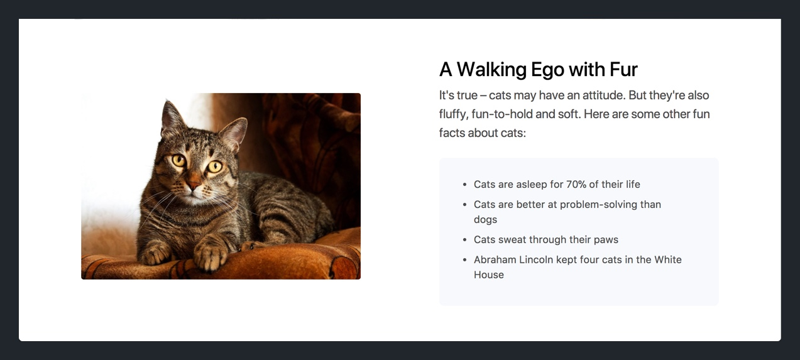

We've given the columns both vertical and horizontal alignment!

# Responsiveness

Up to this point, we've only addressed content for browsers with width of >1170px. But what happens if someone is viewing our landing page on thier phone? Or what if their browser is positioned so that the browser width is small?

For our current website, our layout would break and be practically unreadable:

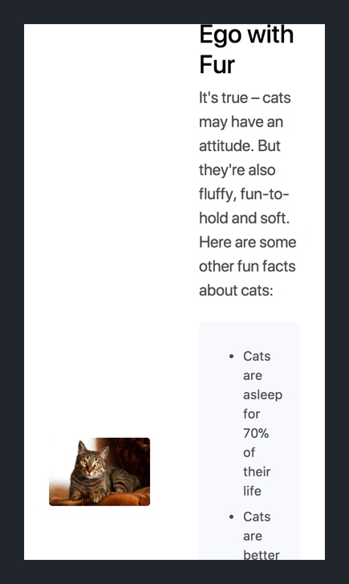

To remedy this, we'll learn about responsiveness and how to built websites that dynamically adjust to the width of the screen.

As you know the device of a screen can be all different types of sizes. So we'll need to take this into account and create layouts that adjust as necessary.

## Grid Breakpoints

To account for responsiveness, Bootstrap's grid system already has built into various breakpoints that adjust the grid at certain screen widths. This allows us to easily adjust the layout for each screen size.

The 5 breakpoints are:

- Extra Small: <576px
- Small: >= 576px
- Medium: >= 768px
- Large: >= 992px
- Extra Large: >= 1200px

Each of these breakpoints has it's own column class prefix that allows us to specify how we want the column layout to appear for each breakpoint.

<!-- TODO: convert below to a table -->

- Extra Small: `.col-`
- Small: `.col-sm-`
- Medium: `.col-md-`
- Large: `.col-lg-`
- Extra Large: `.col-xl-`

To understand what this means, let's look at the code below:

```
<div class="container">
  <div class="row">
    <div class="col-12 col-md-8 col-lg-4">
      <!-- ... HTML content -->
    </div>
  </div>
</div>
```

This means that our column will take up the entire row when the screen size is <576px. When the screen width is >=768px then it will take up 8 of the 12 column width and if the screen width is >=992px, then the column will become the size of 4 of the 12 columns.

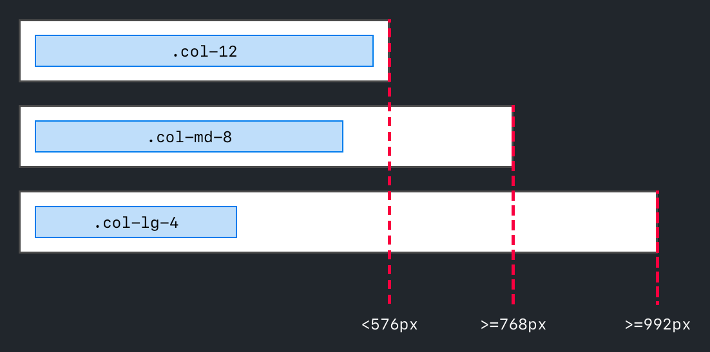

As you can see, this gives us a flexible way to position our content in multiple layouts across different screen sizes.

## Adding Grid Breakpoints to our Columns

To fix the broken layout for the first section of our landing page, we'll add another layout for different grid breakpoints.

> [challenge]
>
Adjust your columns so that each column takes up the entire screen on a small device, but adjust itself back to a size of 5 columns once the screen reaches the large breakpoint.

<!-- break -->

> [solution]
>
We can assign different size classes by using the different column prefixes:
>
```
<div class="container">
  <div class="row align-items-center justify-content-around">
    <div class="col-12 col-lg-5">
      <!-- ... existing HTML content -->
    </div>

    <div class="col-12 col-lg-5">
      <!-- ... existing HTML content -->
    </div>
  </div>
</div>
```

Now if we refresh our landing page and resize our browser, you'll notice that our content adjusts itself automatically depending on the width of the browser. In addition, our layout is no longer hard to read on mobile devices!

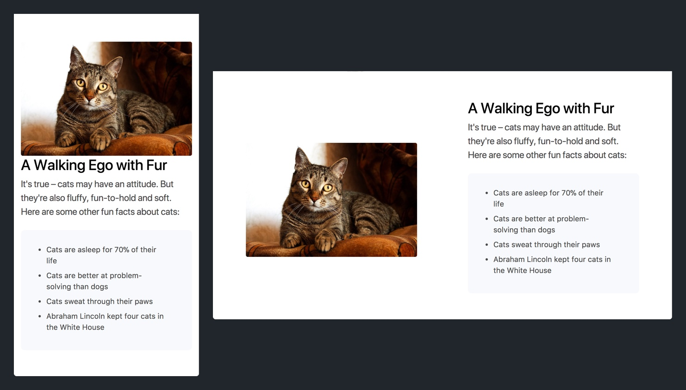

## Responsive Styling with Media Queries

In addition to using the grid breakpoints that Bootstrap provides, we can also create _media queries_ in our CSS stylesheet that apply the correct CSS rule depending on the device width. This can be especially useful for adjusting properties such as font, padding, margin on different screen sizes.

Media queries have the following format:

```
@media (min-width: 768px) {
  /* insert CSS rules for this screen size */
}
```

Notice that the the _min-width_ refers to the minimum width the screen must be in order for the CSS rule within the media query block to be applied.

Let's go ahead and create our first media query that adds a margin to the bottom of our image depending on the screen size.

> [action]
>
In `style.css`, add a media query that adds a bottom margin depending on the screen size:
>
```
.first-section img {
  margin-bottom: 35px;
}
>
@media (min-width: 768px) {
  .first-section img {
    margin-bottom: 20px;
  }
}
>
@media (min-width: 992px) {
  .first-section img {
    margin-bottom: 0;
  }
}
```
>
With the CSS above, a bottom margin of 35px will be applied whenever the screen width is less than 768px. Once the screen is 768px and above, the `` element will have a bottom margin of 20px. And finally, if the screen size is above 992px, then the bottom margin of the `` will be set to 0.

If you refresh your landing page, you'll notice that when the browser width is less than 768px, it now has a bottom margin to help separate the image with the following text below.

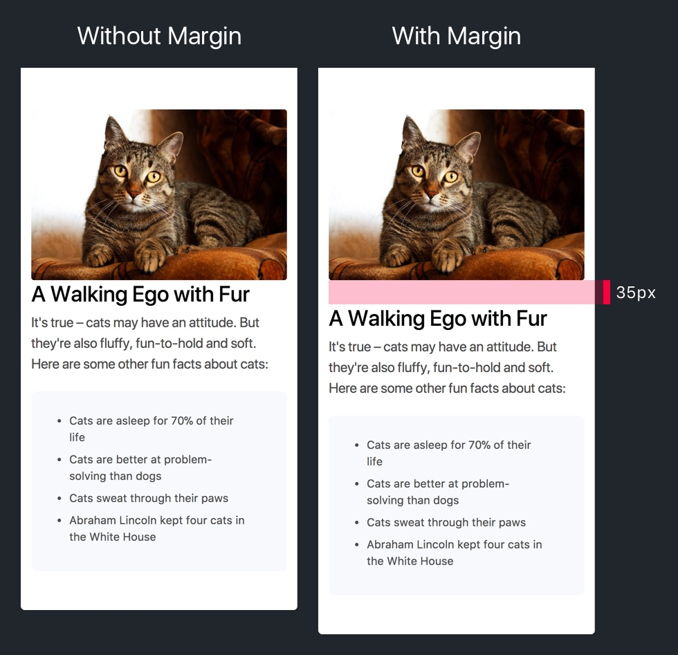

Let's try another.

> [challenge]
>
Add a media query that changes the `<h1>` element's property of `font-size` to `48px` if the screen width is above 576px. In your stylesheet, you should already have a CSS rule that adds the following declarations to the `<h1>` element:
>
```
h1 {
  color: #000000;
  font-size: 36px;
}
```

<!-- break -->

> [solution]
>
In `style.css`, you should add the additional media query:
>
```
@media (min-width: 576px) {
  h1 {
    font-size: 48px;
  }
}
```

Using media queries, we can adjust our font-size for various screen widths. This way it's easier for people who land on our landing page to read.

Let's finish with a couple more challenges for media queries.

> [challenge]
>
Add a media query that gives and element with the `.section` class a top and bottom padding of 100px when the screen width is greater than 100px.

<!-- break -->

> [solution]
>
```
@media (min-width: 576px) {
  .section {
    padding: 100px 0;
  }
}
```

<!-- break -->

> [challenge]
>
1. Change the existing padding for your header so that the top padding is 140px and the bottom padding is 100px.
2. Add a media query that changes the padding for your header from the values in 1) to 200px for both the top and bottom once the screen width is 576px.

<!-- break -->

> [solution]
>
In `style.css`, you should have modified and added the following CSS:
>
```
header {
  background-color: #F0F8FF;
  background-image: url("../img/jumping_cats.jpg");
  background-size: cover;
  background-position: center center;
  background-repeat: no-repeat;
  padding: 140px 0 100px;
}
>
@media (min-width: 576px) {
  header {
    padding: 200px 0;
  }
}
```

With media queries, you can add a lot of additional customization for various viewports (screen widths) using CSS.

# Putting It Together

In this section, we've learned one of the most powerful parts of Bootstrap: the grid system. We learned about how to create layouts, responsiveness and how to adjust our columns based on device width and more.

Before we move on, let's implement the second section of our landing page. To review the design:

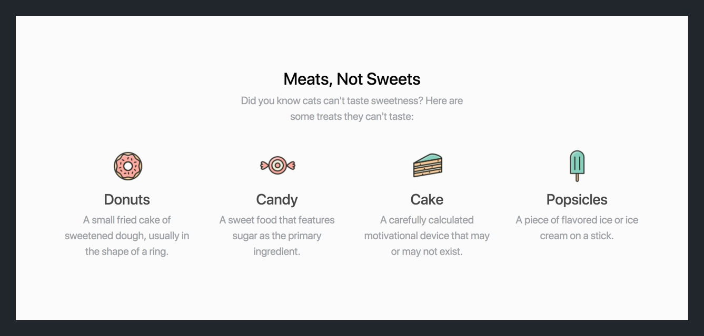

The second section of our landing page will change layout based on grid breakpoints:

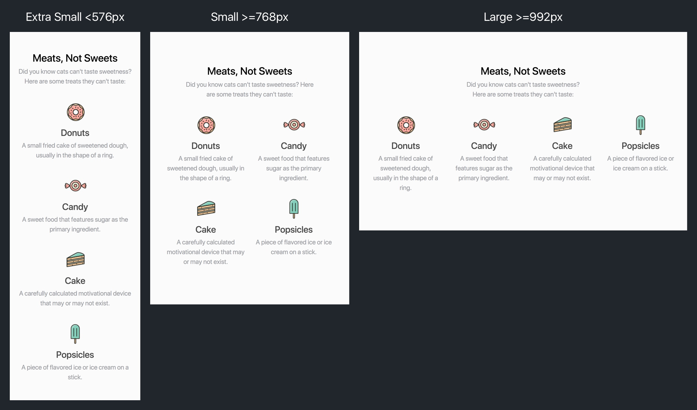

Let's start with the basics, creating a new section and setting up the grid.

> [challenge]
>
In `index.html`, let's begin implementing the second section of our landing page:
>
1. Create a new outer `<div>` element with the `.section` and `.second-section` classes.
1. In your stylesheet, create a new CSS rule that sets the background color of `.second-section` to `#FBFBFB`.
1. Within your `.second-section` `<div>` element, create a new `<div>` element with the class `.container`.

<!-- break -->

> [solution]
>
In `index.html`, under your first section, add the following HTML:
>
```
<!-- index.html -->
<div class="section second-section">
  <div class="container">
  </div>
</div>
```
>
In your stylesheet, you should add the following:
>
```
/* style.css */
.second-section {
  background-color: #FBFBFB;
}
```

With our new container, we can create our first row. This time, instead of putting all of our content into a single row, we're going to break the section heading and subheading into a separate row.

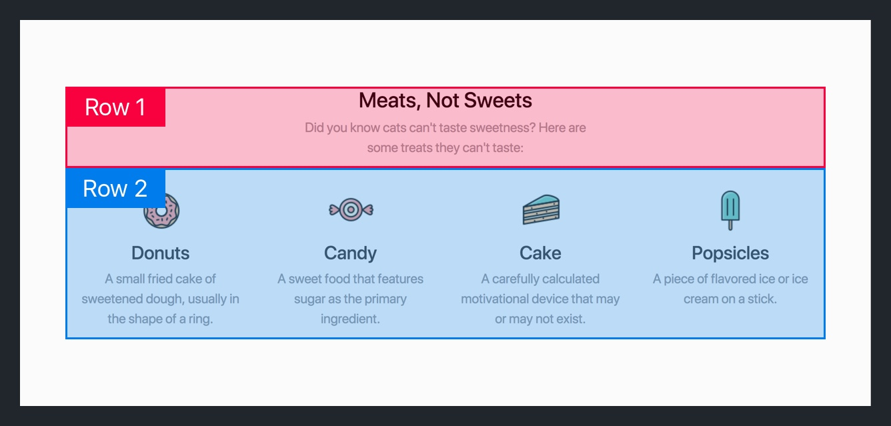

Let's work on implementing the first row of our second section containing the heading and subheading.

## Implementing the Heading and Subheading

> [action]
>
First, lets finish the remaining grid setup by adding a row and column that takes up the full width when the grid breakpoint is extra small:
>
```
<div class="section second-section">
  <div class="container">
    <div class="row">
      <div class="col-12">
>
        <!-- add heading and subheading HTML here -->
>
      </div>
    </div>
  </div>
</div>
```

With the following setup, we can implement the HTML content for the heading and subheading of our second section.

> [challenge]
>
Add the HTML content for the heading and subheading of the second section:
>
1. Add a `<h2>` element with the content: `Meats, Not Sweets`
1. Add a paragraph element with the content: `Did you know cats can't taste sweetness? Here are some treats they can't taste:`

When you're done, make sure your solution matches below.

> [solution]
>
```
<div class="section second-section">
  <div class="container">
    <div class="row">
      <div class="col-12">
        <h2>Meats, Not Sweets</h2>
        <p>Did you know cats can't taste sweetness? Here are some treats they can't taste:</p>
      </div>
    </div>
  </div>
</div>
```

Next, we'll work on making our column width responsive depending on each grid breakpoint.

> [challenge]
>
Using the image below, add the follow code to make your column size the following for each grid breakpoint:
>
1. Extra Small: Full Width (12)
1. Small: 10 Columns
1. Medium: 8 Columns
1. Large: 5 Columns
>
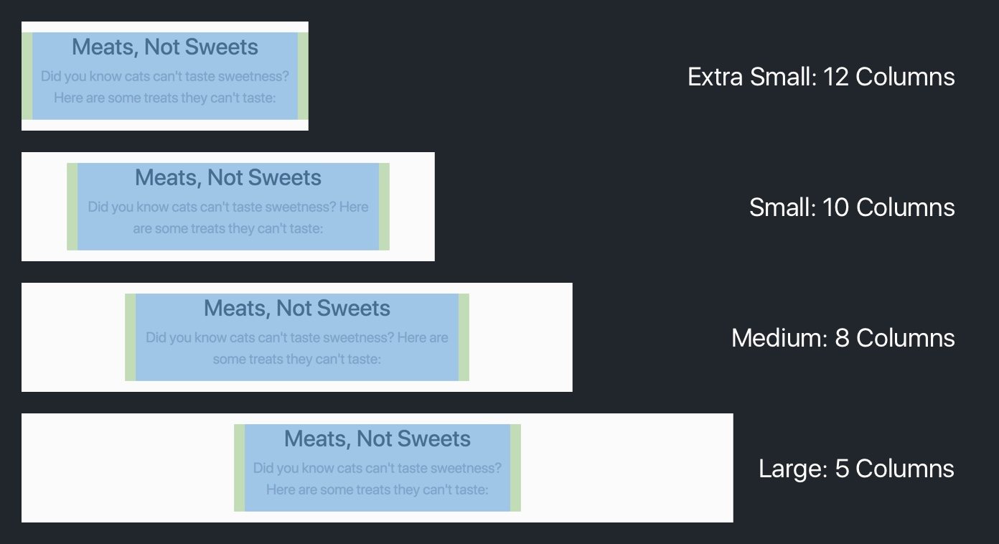

<!-- break -->

> [solution]
>
If we add the grid breakpoints to our column, our code should now look like the following:
>
```
<div class="section second-section">
  <div class="container">
    <div class="row">
      <!-- responsive column size for grid breakpoints -->
      <div class="col-12 col-sm-10 col-md-8 col-lg-5">
        <h2>Meats, Not Sweets</h2>
        <p>Did you know cats can't taste sweetness? Here are some treats they can't taste:</p>
      </div>
    </div>
  </div>
</div>
```

Before continuing, let's refresh our landing page in our browser and take a look:

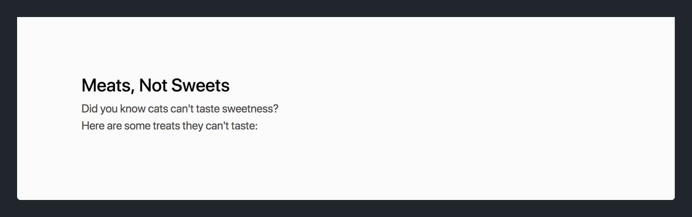

You'll notice that the column size and HTML content are correct, but it's currently unaligned. Let's fix that by adding some of that Bootstrap CSS.

> [challenge]
>
Use the Bootstrap CSS classes we learned about to do the following:
>
1. Align the column horizontally within the center of the row.
1. Align the text so that it's aligned to the center.

<!-- break -->

> [solution]
>
You should have added the `.justify-content-center` and `text-center` classes as follows:
>
```
<div class="section second-section">
  <div class="container">
    <div class="row justify-content-center text-center">
      <div class="col-12 col-sm-10 col-md-8 col-lg-5">
        <h2>Meats, Not Sweets</h2>
        <p>Did you know cats can't taste sweetness? Here are some treats they can't taste:</p>
      </div>
    </div>
  </div>
</div>
```

Refresh your landing page in your browser. You should see the following:

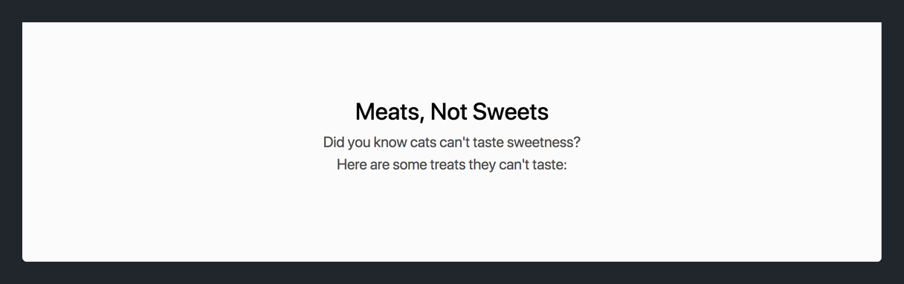

Try resizing your browser and seeing how our column sizing adjusts as each grid breakpoint is hit.

## Implementing the Treats Row

Let's move onto something a little more challenging. This time, you'll lead the implementation.

We're going to build out the row of treats in our second section which is a row of different sweets (that cat's can't taste.)

Here's the design we'll be following:

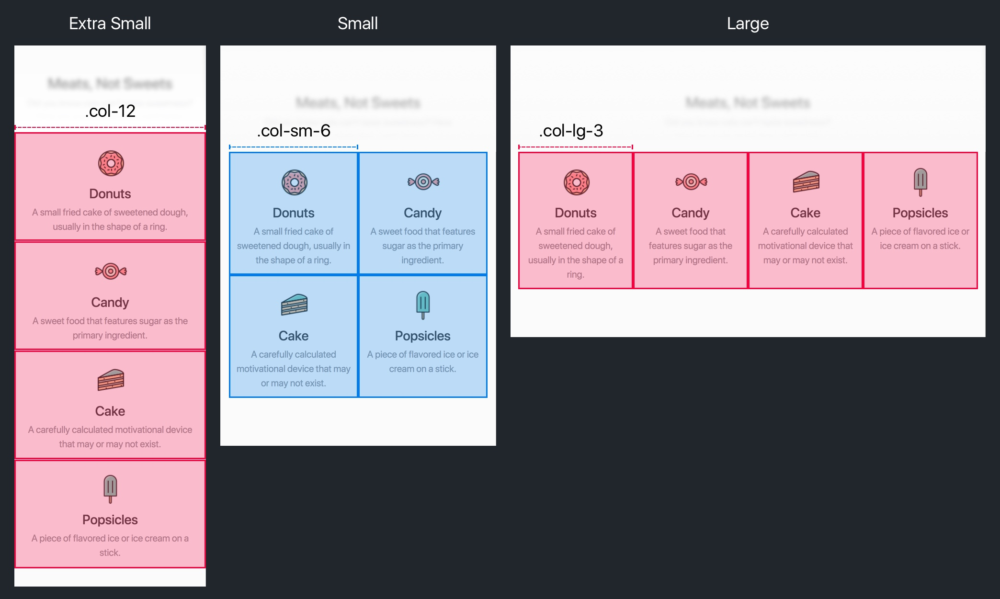

Let's start by downloading our treat images and placing them in our `img` folder.

> [action]
>
Download the treat icon assets by [clicking here.](https://www.dropbox.com/s/3j40crttal2z4vo/treat_icons.zip?dl=1) Don't forget to move the icons to the `img` folder of your project.

<!-- break -->

> [info]
>
The treat icons used in this project were designed by [Paula Jenda](https://dribbble.com/PaulaYnn). If you're looking for more high quality icons and design assets to use in your project, you can check out [Icon Store.](https://iconstore.co/) Icon Store is a great resource for finding well designed icons that can be used in your projects.

With your new icon set, you can begin implementing your new HTML and CSS.

> [challenge]
>
Through the course of this tutorial, we've learned the necessary skills to implement all the code in the design. We've learned about using HTML to add content, CSS to style elements and Bootstrap to position our layout.
>
Now it's your turn. Use the outline below to implement the HTML and CSS to complete the second section: 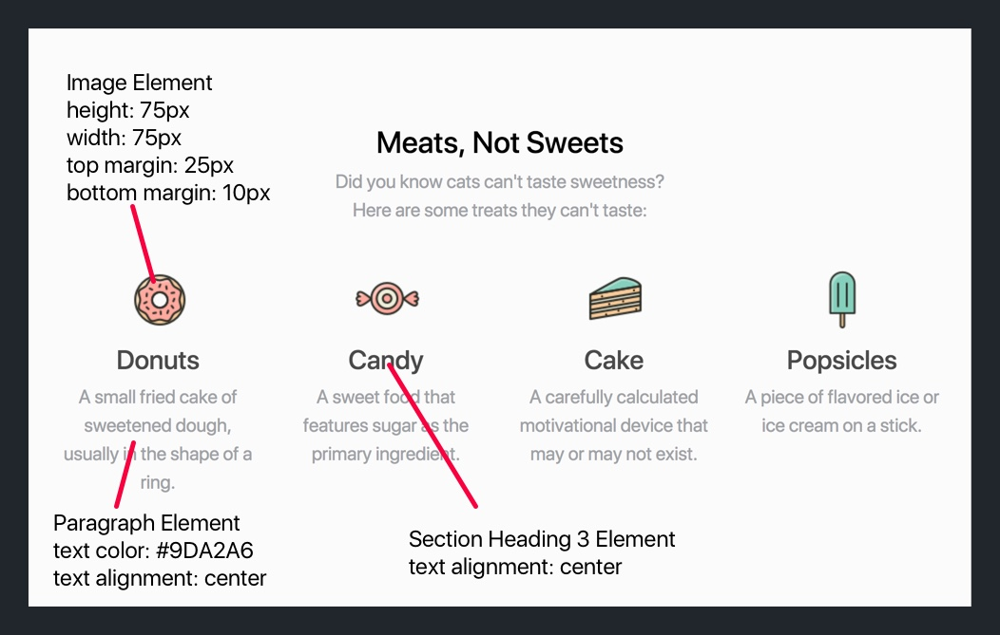
>
You'll also need to reference the grid breakpoints to add responsive sizing to each column: 

If you get stuck with the challenge, review back on the previous sections or steps where we walked through implementing HTML and CSS together. After you're done, check your solution below.

> [solution]
>
In `index.html`, you should have implemented the following HTML and CSS for the second row in the second section:
>
```
<!-- HTML -->
>
<div class="row text-center">
  <div class="col-12 col-sm-6 col-lg-3">
    
    <h3>Donuts</h3>
    <p>A small fried cake of sweetened dough, usually in the shape of a ring.</p>
  </div>
  <div class="col-12 col-sm-6 col-lg-3">
    
    <h3>Candy</h3>
    <p>A sweet food that features sugar as the primary ingredient.</p>
  </div>
  <div class="col-12 col-sm-6 col-lg-3">
    
    <h3>Cake</h3>
    <p>A carefully calculated motivational device that may or may not exist.</p>
  </div>
  <div class="col-12 col-sm-6 col-lg-3">
    
    <h3>Popsicles</h3>
    <p>A piece of flavored ice or ice cream on a stick.</p>
  </div>
</div>
```
>
In `style.css`, you should have added the following CSS rules:
>
```
/* CSS */
>
.second-section p {
  color: #9DA2A6;
}
>
.second-section img {
  height: 75px;
  margin: 25px 0 10px;
  width: 75px;
}
```

Wow, that was quite a bit of code you just implemented. Nice job, you're starting to get the hang of this. A little more practice and you'll be able to take on whatever design you want to create on your own.

In the next section, we're going to look more in-depth in implementing a full Bootstrap component: the navbar!
