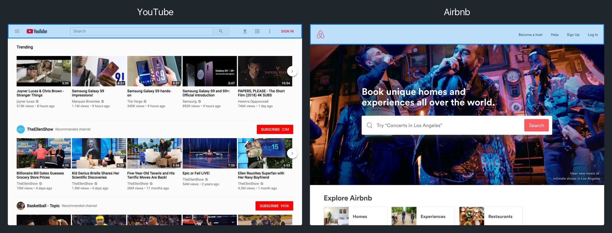
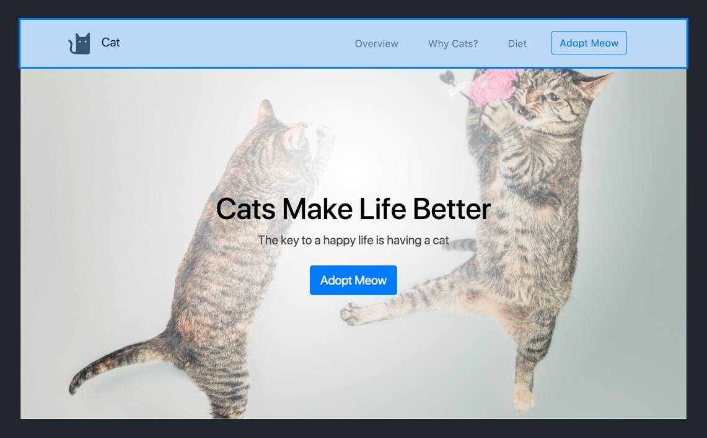
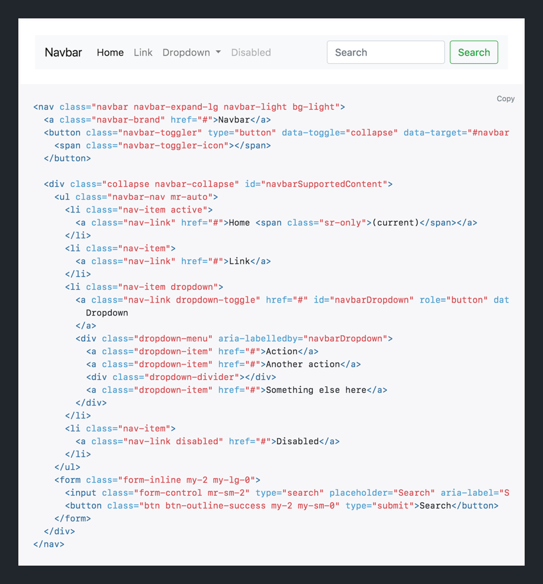
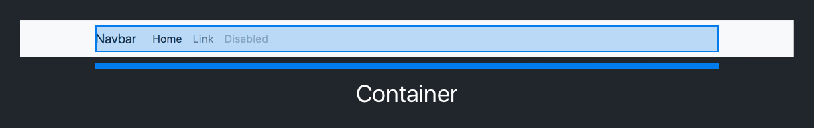
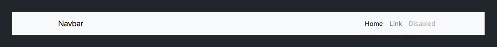
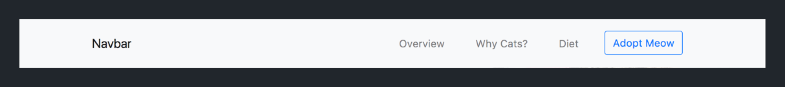
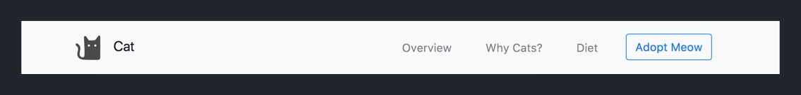
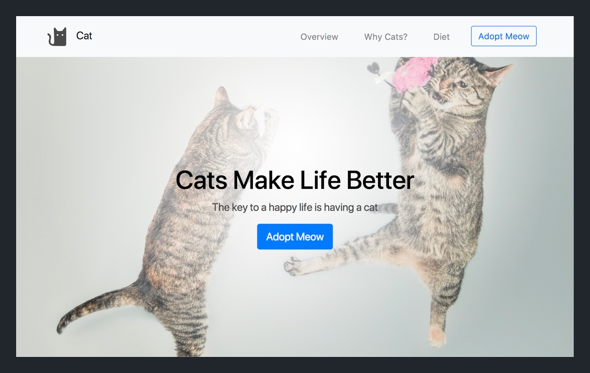
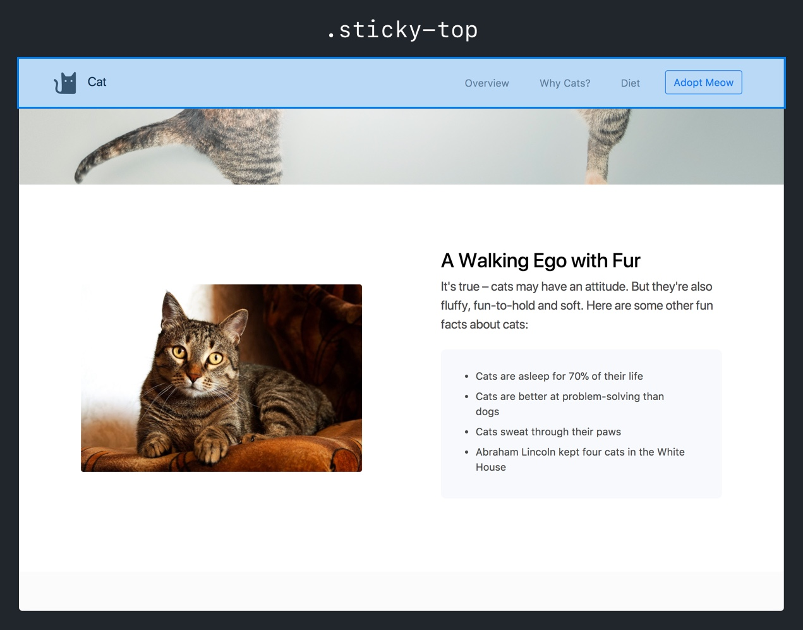

Navbars are a common UI component that provide users with a quick, familiar way of navigating around your website.

You can see various designs of navbars implemented in many popular websites:



In this section, we'll learn to implement a navbar using Bootstrap's navbar component. This will provides us with a quick solution that we can re-use throughout our projects and customize based on each individual website's design.

When we're done, our landing page will have the following navbar at the top of the browser:



# Implementing the Navbar

Before we start building and customizing our navbar, let's first open the Bootstrap docs. This will give us a reference if need sample code or have questions on best practices about implementing our navbar. Open the [navbar documentation](https://getbootstrap.com/docs/4.0/components/navbar/) in another browser tab.


In the navbar documentation, there are many details about differents aspects of the navbar and code snippets as examples to help you implement each aspect.

If you scroll down to the section with the heading [Supported Content](https://getbootstrap.com/docs/4.0/components/navbar/#supported-content), you'll notice that there's sample code for an example navbar. We'll use this code snippet to get started.

> [info]
>
Whenever you're trying to implement a Bootstrap component, it's helpful to start with examples or code snippets provided in the documentation. After starting with the Bootstrap template, you can alter and customize the code to fit your website's own design.

In the documentation, you should see the following:



> [action]
>
In `index.html`, copy and paste the navbar code from the [Bootstrap docs](https://getbootstrap.com/docs/4.0/components/navbar/#supported-content) right above the HTML code for your <header> element.

Refresh your landing page in your browser and you should see the following:


In addition, if you re-size your browser to a smaller viewport, then you should see the navbar collapse into a hamburger menu that you can expand:


> [info]
>
For the navbar hamburger menu to work properly, you'll need to make sure that you've included the JavaScript links at the bottom of your <body> element. The navbar relies on code in these script files to expand and collapse.
>
```
<body>
  <!-- ... existing HTML files -->
>
  <script src="https://code.jquery.com/jquery-3.2.1.slim.min.js" integrity="sha384-KJ3o2DKtIkvYIK3UENzmM7KCkRr/rE9/Qpg6aAZGJwFDMVNA/GpGFF93hXpG5KkN" crossorigin="anonymous"></script>
  <script src="https://cdnjs.cloudflare.com/ajax/libs/popper.js/1.12.9/umd/popper.min.js" integrity="sha384-ApNbgh9B+Y1QKtv3Rn7W3mgPxhU9K/ScQsAP7hUibX39j7fakFPskvXusvfa0b4Q" crossorigin="anonymous"></script>
  <script src="https://maxcdn.bootstrapcdn.com/bootstrap/4.0.0/js/bootstrap.min.js" integrity="sha384-JZR6Spejh4U02d8jOt6vLEHfe/JQGiRRSQQxSfFWpi1MquVdAyjUar5+76PVCmYl" crossorigin="anonymous"></script>
</body>
```

With Bootstrap's navbar template implemented, we'll begin removing code we don't need and customizing the navbar base on our own design.

# Removing Excess Template Code

Many times, code snippets in Bootstrap's documentation will contain extra code that you won't need. We'll start by removing the parts of the navbar template that we don't need, starting with the search bar.

> [action]
>
In `index.html`, remove the HTML code for the search bar and button within the <form> element.
>
```
<nav class="navbar navbar-expand-lg navbar-light bg-light">
  <a class="navbar-brand" href="#">Navbar</a>
  <button class="navbar-toggler" type="button" data-toggle="collapse" data-target="#navbarSupportedContent" aria-controls="navbarSupportedContent" aria-expanded="false" aria-label="Toggle navigation">
    <span class="navbar-toggler-icon"></span>
  </button>
>
  <div class="collapse navbar-collapse" id="navbarSupportedContent">
    <ul class="navbar-nav mr-auto">
      <li class="nav-item active">
        <a class="nav-link" href="#">Home <span class="sr-only">(current)</span></a>
      </li>
      <li class="nav-item">
        <a class="nav-link" href="#">Link</a>
      </li>
      <li class="nav-item dropdown">
        <a class="nav-link dropdown-toggle" href="#" id="navbarDropdown" role="button" data-toggle="dropdown" aria-haspopup="true" aria-expanded="false">
          Dropdown
        </a>
        <div class="dropdown-menu" aria-labelledby="navbarDropdown">
          <a class="dropdown-item" href="#">Action</a>
          <a class="dropdown-item" href="#">Another action</a>
          <div class="dropdown-divider"></div>
          <a class="dropdown-item" href="#">Something else here</a>
        </div>
      </li>
      <li class="nav-item">
        <a class="nav-link disabled" href="#">Disabled</a>
      </li>
    </ul>
  </div>
</nav>
```

Next, we'll delete the dropdown menu from our navbar links.

> [action]
>
In `index.html`, delete the <li> element with a dropdown menu.
>
```
<nav class="navbar navbar-expand-lg navbar-light bg-light">
  <a class="navbar-brand" href="#">Navbar</a>
  <button class="navbar-toggler" type="button" data-toggle="collapse" data-target="#navbarSupportedContent" aria-controls="navbarSupportedContent" aria-expanded="false" aria-label="Toggle navigation">
    <span class="navbar-toggler-icon"></span>
  </button>
>
  <div class="collapse navbar-collapse" id="navbarSupportedContent">
    <ul class="navbar-nav mr-auto">
      <li class="nav-item active">
        <a class="nav-link" href="#">Home <span class="sr-only">(current)</span></a>
      </li>
      <li class="nav-item">
        <a class="nav-link" href="#">Link</a>
      </li>
      <li class="nav-item">
        <a class="nav-link disabled" href="#">Disabled</a>
      </li>
    </ul>
  </div>
</nav>
```

# Adding a Container to our Navbar

Currently, our navbar takes up the full width of the screen. We want to change this behavior so that it takes up the full screen up to a fixed width of the `.container` class. Utimately, adding a container to your navbar is up to your website's design and your own preference.

> [challenge]
>
Using the documentation, implement the navbar so that it's content is contained within a Bootstrap `.container` class. When you're done, your landing page should look like the following: 
>


<!-- break -->

> [solution]
>
You should have moved the HTML content within your <nav> element into a `.container` <div>:
>
```
<nav class="navbar navbar-expand-lg navbar-light bg-light">
  <div class="container">
    <a class="navbar-brand" href="#">Navbar</a>
    <button class="navbar-toggler" type="button" data-toggle="collapse" data-target="#navbarSupportedContent" aria-controls="navbarSupportedContent" aria-expanded="false" aria-label="Toggle navigation">
      <span class="navbar-toggler-icon"></span>
    </button>
>
    <div class="collapse navbar-collapse" id="navbarSupportedContent">
      <ul class="navbar-nav mr-auto">
        <li class="nav-item active">
          <a class="nav-link" href="#">Home <span class="sr-only">(current)</span></a>
        </li>
        <li class="nav-item">
          <a class="nav-link" href="#">Link</a>
        </li>
        <li class="nav-item">
          <a class="nav-link disabled" href="#">Disabled</a>
        </li>
      </ul>
    </div>
  </div>
</nav>
```

## Positioning Navbar Links

Next, we'll work on positioning the links in our navbar. Currently they're on the left-side of our navbar. Let's move them so that they're positioned on the right side of the navbar.

> [action]
>
We can use [auto margins](https://getbootstrap.com/docs/4.0/utilities/flex/#auto-margins) to help position our navbar links.
>
In `index.html`, modify your navbar navigation links so that they're positioned on the right side. You can change the `mr-auto` class to `ml-auto` to achieve this layout:
>
```
<!-- change the class mr-auto to ml-auto in <ul> element below -->
<ul class="navbar-nav ml-auto">
  <li class="nav-item active">
    <a class="nav-link" href="#">Home <span class="sr-only">(current)</span></a>
  </li>
  <li class="nav-item">
    <a class="nav-link" href="#">Link</a>
  </li>
  <li class="nav-item">
    <a class="nav-link disabled" href="#">Disabled</a>
  </li>
</ul>
```

Refresh your landing page and you should see the following:



Nice! Getting closer.

# Setting our Links

Now that our navbar links are positioned on the right side, let's configure them so that they're properly named and styled.

> [action]
>
In `index.html`, modify the navbar links in your <nav> element to the following:
>
```
<ul class="navbar-nav ml-auto">
  <li class="nav-item">
    <a class="nav-link" href="#">Overview</a>
  </li>
  <li class="nav-item">
    <a class="nav-link" href="#">Why Cats?</a>
  </li>
  <li class="nav-item">
    <a class="nav-link" href="#">Diet</a>
  </li>
</ul>
```

We'll also need to add a CTA button so that our users can easily adopt their own cat.

> [action]
>
In `index.html`, modify the navbar links to include a CTA button:
>
```
<ul class="navbar-nav ml-auto">
  <li class="nav-item">
    <a class="nav-link" href="#">Overview</a>
  </li>
  <li class="nav-item">
    <a class="nav-link" href="#">Why Cats?</a>
  </li>
  <li class="nav-item">
    <a class="nav-link" href="#">Diet</a>
  </li>
  <li class="nav-item">
    <a class="btn btn-outline-primary my-2 my-sm-0" href="#">Adopt Meow</a>
  </li>
</ul>
```

Finally, we'll finish by adding some CSS to add some spacing between each navbar link.

> [challenge]
>
In `style.css`, add a CSS rule that gives each `.nav-item` a top and bottom margin of 10px and a left and right margin of 16px.

<!-- break -->

> [solution]
>
In your stylesheet, you should have added the following CSS rule:
>
```
.nav-item {
  margin: 10px 16px;
}
```

When you're done, refresh your landing page in your browser. You should see the following:



Our navbar links match our design. Next, let's customize the left side of our navbar by setting our landing page's logo.

# Adding a Navbar Logo

Let's add a logo to our navbar. To review our design, our finished navbar will look like the following:



First we'll need to download our cat logo.

<!-- TODO: insert link for downloading cat image -->

> [action]
>
Download our cat logo by [clicking here.](insert-link)

To implement our logo in our navbar, we can reference the [documentation](https://getbootstrap.com/docs/4.0/components/navbar/#brand) on how to add brand images to the navbar. If you scroll down to the example code of the navbar with both a logo and brand name, you can use the code snippet to implement our design.

> [challenge]
>
In `index.html`, implement the design for our navbar's logo.

When you're done, check your solution below.

> [solution]
>
You will have modified your navbar's HTML to the following:
>
```
<nav class="navbar navbar-expand-lg navbar-light bg-light">
  <div class="container">
    <a class="navbar-brand" href="#">
      
      Cat
    </a>
    
    <!-- ... existing HTML content -->
  </div>
</nav>
```
>
You'll notice that the code snippet inclues some extra CSS classes that we won't need to apply to our own logo  element.

Before we continue, we'll need to add some additional CSS styling to configure our  element properly.

> [challenge]
>
Add a CSS rule to set the logo  element to set the height and width to 46px and a right margin of 8px. 

<!-- break -->

> [solution]
>
```
.navbar-brand img {
  height: 46px;
  margin-right: 8px;
  width: 46px;
}
```

When you're done, refresh your landing page, and you should see the following:



# Setting our Navbar Placement

There's one last thing we need to customize for our navbar: it's placement. Once again, we can reference the Bootstrap documentation by [clicking here.](https://getbootstrap.com/docs/4.0/components/navbar/#placement)

We want to set our placement so that our navbar always sticks to the top of the browser and scrolls with the user.

> [challenge]
>
Using the [Boostrap documentation](https://getbootstrap.com/docs/4.0/components/navbar/#placement) on navbar placement, configure the navbar so that it sticks to the top of the browser as the user scrolls.

<!-- break -->

> [solution]
>
To specify the sticky top behavior, all we have to do is add the `.sticky-top` class to our <nav> element:
>
```
<!-- add sticky-top class to <nav> element below -->
<nav class="navbar sticky-top navbar-expand-lg navbar-light bg-light">
  <!-- ... existing HTML content -->
</nav>
```

Now, refresh your landing page and start scrolling up and down. Notice that your navbar now sticks to the top of our browser and scrolls as you do.



# Up Next

In this section, we learned about navbars. We learned how to implement and customize Bootstrap's navbar component. 

Throughout the process, we heavily relied on Bootstrap's documentation to implement the Bootstrap component. You should now have idea for the process for how to implement a Bootstrap component using the documentation and examples Bootstrap provides.

In the next section, we'll put all of the skills and knowledge to practice by implementing a couple more sections for our landing page. 

Get ready! This time you'll be doing the majority of the work!
