At this point in the tutorial, we've covered all the base knowledge necessary to finish the remaining part of our landing page design. In this section, we'll reinforce what we've learned through repetition and practice.

To begin, let's download the remaining image assets needed for our landing page.

> [action]
>
Download the remaining image assets for our landing page by [clicking here.](insert-link-here) Make sure to move the image assets to your project's `img` folder.

<!-- TODO: insert link here -->

With our new image assets, we're ready to begin building the rest of our landing page.

# Implementing our Third Section

The next section of our landing page will be the third section:

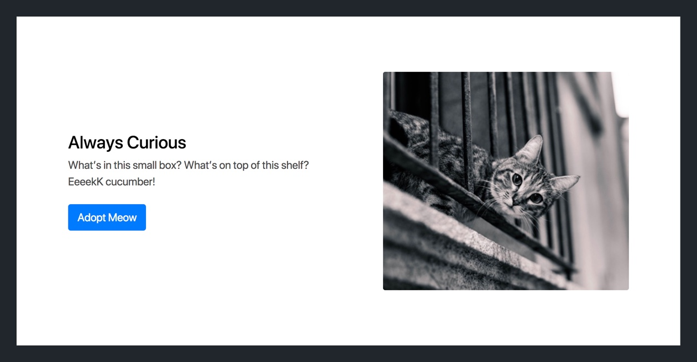

You may be thinking that our landing page's first and third section are very similar.

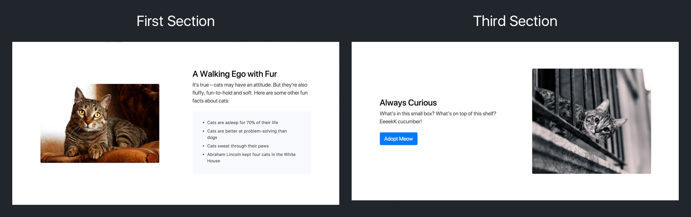

That's because they are! The main difference being that the image and content are reversed between the two.

With that in mind, let's implement the HTML and CSS for the third section. This time you'll do most of the heavy lifting.

> [challenge]
>
Using the diagrams provided below, implement the design for the third section of the landing page.
>
If you get stuck, remember that the first and third section are very similar. You can use the previous code and go back to the tutorial section for reference.
>
Grid Breakpoints: 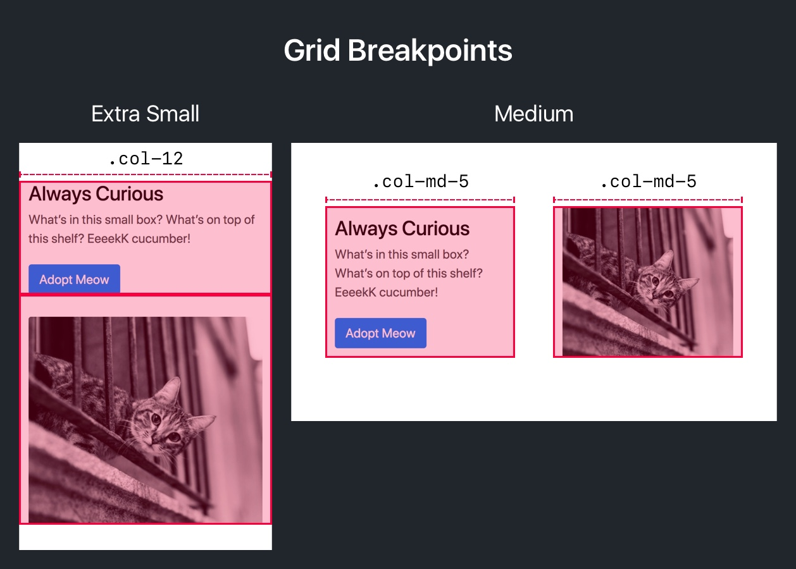
>
HTML Elements and Classes: 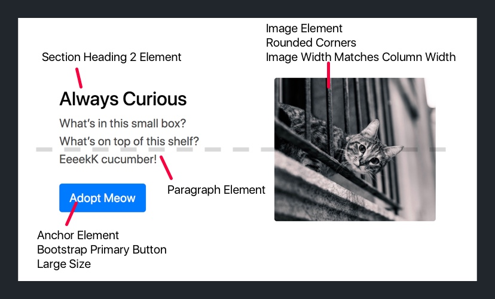
>
Additional CSS:
>
- Give the third section a white background color
- Give the `` element a top margin of 35px
- Add a media query that sets top margin of the `` element to 0 if the screen width is above 768px

<!-- break -->

> [solution]
>
Check your solution below:
>
HTML:
>
```
<div class="section third-section">
  <div class="container">
    <div class="row align-items-center justify-content-around">
      <div class="col-12 col-md-5">
        <h2>Always Curious</h2>
        <p>What’s in this small box? What’s on top of this shelf? EeeekK cucumber!</p>
        <a class="btn btn-lg btn-primary" href="#">Adopt Meow</a>
      </div>
>
      <div class="col-12 col-md-5">
        
      </div>
    </div>
  </div>
</div>
```
>
CSS:
>
```
third-section {
  background-color: white;
}
>
.third-section img {
  margin-top: 35px;
}
>
@media (min-width: 768px) {
  .third-section img {
    margin-top: 0;
  }
}
```

Refresh your landing page in your browser and you should see the following:

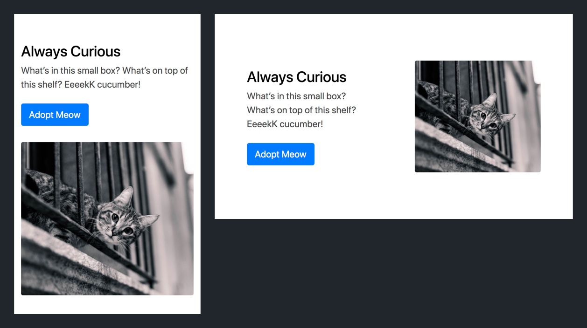

You finished one section of the landing page all on your own. On to the next!

# Implementing the Fourth Section

Let's build the last content section of our landing page. To review the design:

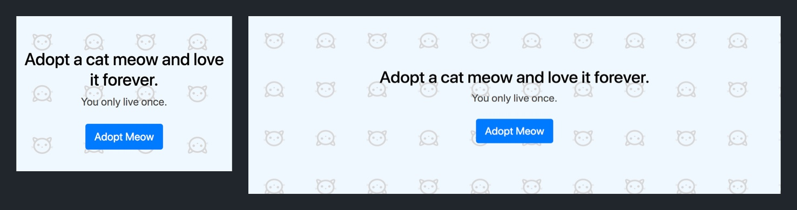

You've done this before. Take from here.

> [challenge]
>
Using the diagrams provided below, implement the design for the fourth section of the landing page.
>
If you get stuck, remember that the `<header>` and fourth section are very similar. You can use the previous code and go back to the tutorial section for reference.
>
Grid Breakpoints: 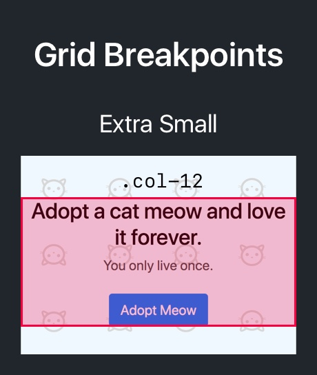
>
HTML Elements and Classes: 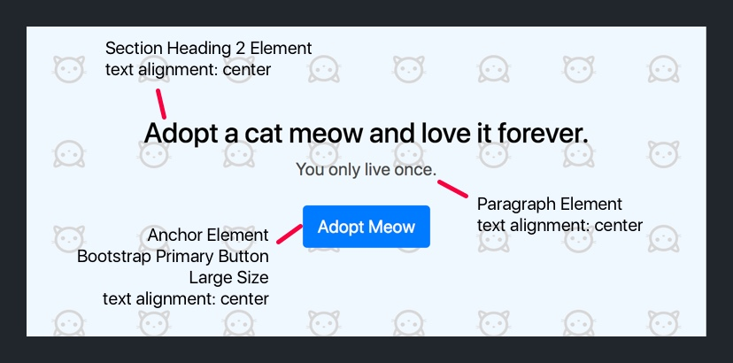
>
Additional CSS:
>
- Give the fourth section a background color of `#F0F8FF`
- Set the fourth section's background image as `cattern.png`
- Set the fourth section's background repeat property as `repeat`
- Set the fourth section's background size with a height and width of `192px`

<!-- break -->

> [solution]
>
Check your solution below:
>
HTML:
>
```
<div class="section fourth-section">
  <div class="container">
    <div class="row">
      <div class="col-12 text-center">
        <h2>Adopt a cat meow and love it forever.</h2>
        <p>You only live once.</p>
        <a class="btn btn-lg btn-primary" href="#">Adopt Meow</a>
      </div>
    </div>
  </div>
</div>
```
>
CSS:
>
```
.fourth-section {
  background-color: #F0F8FF;
  background-image: url("../images/cattern.png");
  background-repeat: repeat;
  background-size: 192px 192px;
}
```

Refresh your landing page in your browser and you should see the following:

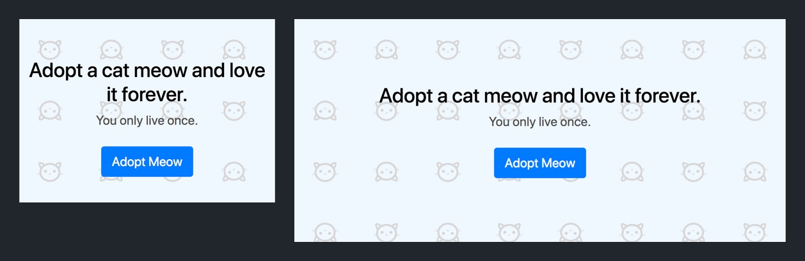

We've now finished the last section of our landing page. To finish up, we'll implement the footer of our landing page.

# Implementing the Footer

To finish up, we'll need to implement the footer of our landing page. Don't worry, it'll be simple.

The footer of a website usually contains copyright, privacy policy or other company-related information. In our case, we'll just add a line of text on where our landing page was built. Let's look at the design:

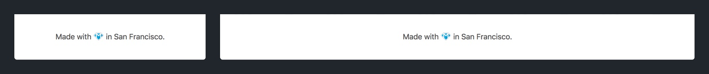

> [challenge]
>
Using the diagrams provided below, implement the design for the footer of the landing page.
>
Grid Breakpoints: Because the `<footer>` element only contains a single line of text, we won't use a grid to implement our design.
>
HTML Elements and Classes: 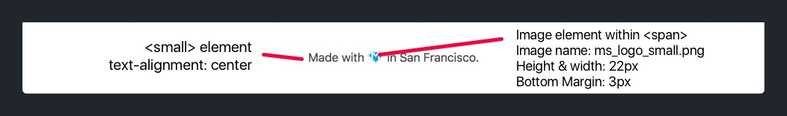
>
Additional CSS:
>
- Give the `<footer>` element a white background color
- Give the `<footer>` a top and bottom padding of 35px
- Set the small Make School logo image to have a height and width of 22px
- Set the small Make School logo image to have a bottom margin of 3px

<!-- break -->

> [solution]
>
Check your solution below:
>
HTML:
>
```
<footer class="text-center">
  <small>Made with <span></span> in San Francisco.</small>
</footer>
```
>
CSS:
>
```
footer {
  background-color: white;
  padding: 35px 0;
}

.footer-logo {
  height: 22px;
  margin-bottom: 3px;
  width: 22px;
}
```

Congrats! You've finished adding the last bit of HTML and CSS to complete the designs for our landing page. If you want to jump around and shout, this is the time! In the last section, we'll review what we've learned and discuss where to go from here.
