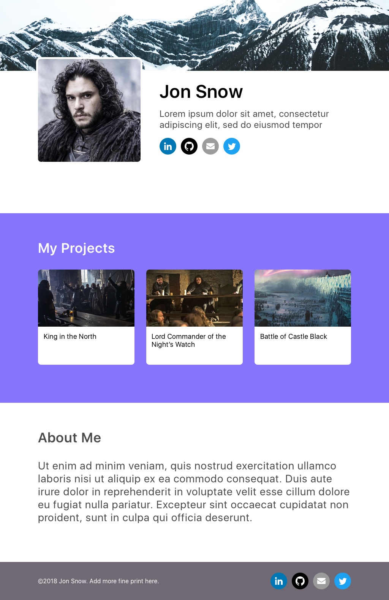

Congrats! You've built your first landing page.

![Landing Page](assets/landing_page_design.jpg**

You taken your first steps on your journey to become an full-stack web developer.

In this tutorial, you were introduced to many new concepts in front-end development. To recap, you learned how to...

- build responsive websites using HTML, CSS, and Bootstrap
- learn to use appropriate HTML elements to display content
- style HTML using CSS and Bootstrap
- position content with Bootstrap's grid system
- implement Bootstrap components and classes
- properly structure HTML to re-create designs and wireframes

Try to remember and visualize what you did for each of these steps in your head.

## Where To Go From Here?

If it went by in a blur, don't worry. You'll need to keep practicing, but eventually these steps will be drilled into your head once you go through the process on your own a few times...

In the upcoming tutorial, we'll take a step back and look at the big picture to understand how the internet works and what it means to be a full-stack developer.

# A Challenge Approaches

To get some extra practice, let's put your skills to the test.

## The Challenge

If you're eventually looking for a job in the tech industry, it's common to have a personal website to display your portifolio and achievements. With your new skills, you're going to build your own personal website.

**Task:** design and build your own personal website.

We've provided a sample design if you're looking for reference. Spend no more than 30 minutes designing your new website on a scratch sheet of paper before starting to code it!

> [info]
>
If you're looking for icons or graphic assets, check out [Icon Store](assets/https://iconstore.co/). If you have Sketch, you can also look for design assets at [Sketch App Sources](https://www.sketchappsources.com/).

